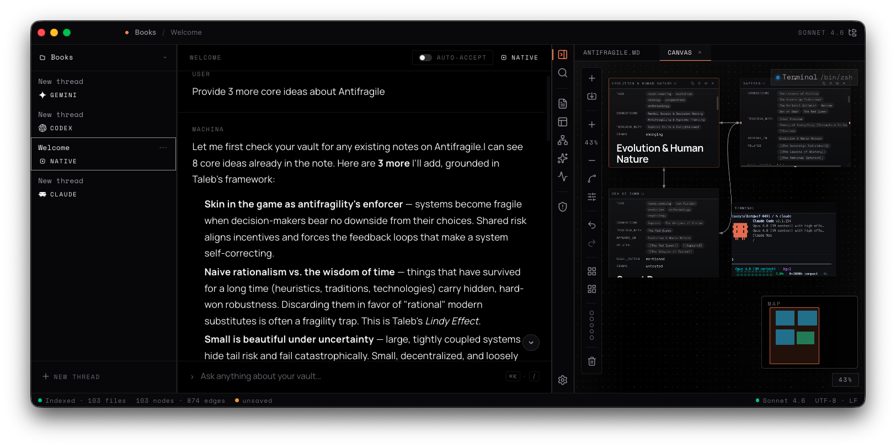
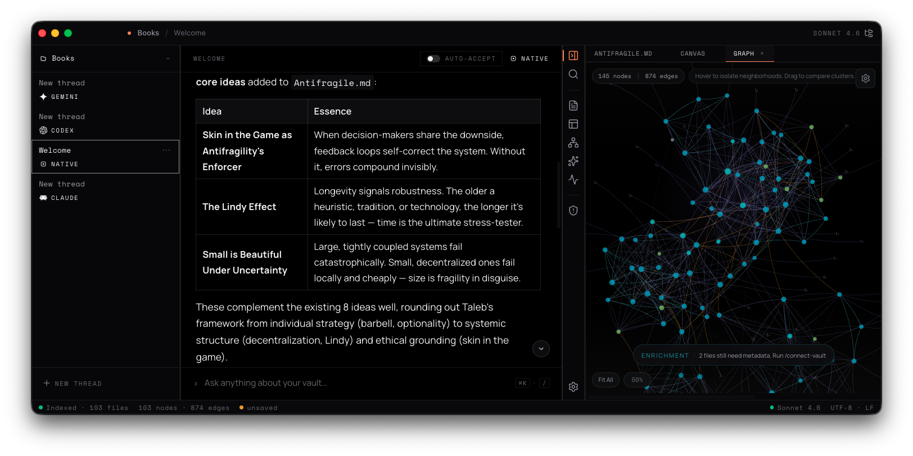
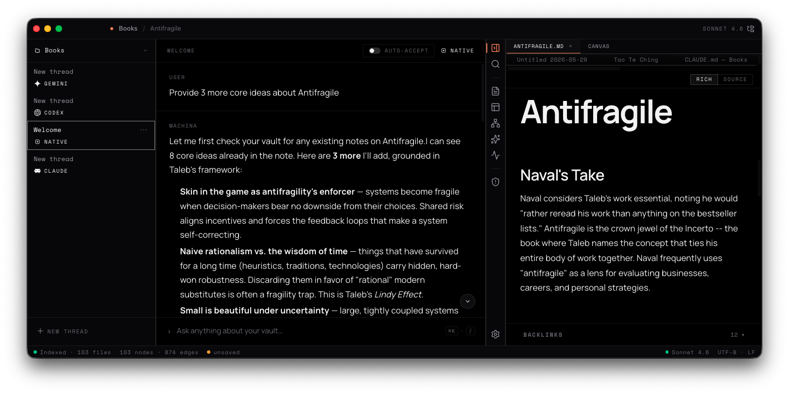

<div align="center">

<pre>
███╗   ███╗ █████╗  ██████╗██╗  ██╗██╗███╗   ██╗ █████╗ 
████╗ ████║██╔══██╗██╔════╝██║  ██║██║████╗  ██║██╔══██╗
██╔████╔██║███████║██║     ███████║██║██╔██╗ ██║███████║
██║╚██╔╝██║██╔══██║██║     ██╔══██║██║██║╚██╗██║██╔══██║
██║ ╚═╝ ██║██║  ██║╚██████╗██║  ██║██║██║ ╚████║██║  ██║
╚═╝     ╚═╝╚═╝  ╚═╝ ╚═════╝╚═╝  ╚═╝╚═╝╚═╝  ╚═══╝╚═╝  ╚═╝
</pre>

**A local-first knowledge engine for spatial thinking**


</div>

Arrange your markdown notes as cards on an infinite canvas, watch a knowledge graph assemble itself from your links and tags, and bring AI agents to the work without handing your notes to the cloud.

Machina is a macOS desktop app. Your notes are plain `.md` files on your disk. The engine reads them, never owns them.



## Why Machina

Most note apps store ideas in a list. Thinking is not a list. Machina treats your vault as a graph of typed relationships and gives you three ways to work with it at once: a freeform spatial canvas, a force-directed graph view, and a rich markdown editor, all backed by a single dependency-free engine kernel.

- Local-first: notes stay on disk as portable markdown; the engine parses, it does not lock in.
- Spatial: lay out cards on a pannable, zoomable surface and let related ideas cluster into labeled regions.
- Connected: relationships are extracted automatically from wikilinks, frontmatter, tags, and co-occurrence.
- Honest about gaps: unresolved `[[wikilinks]]` surface as "ghosts," ideas you have referenced but not yet written.
- AI-ready: a built-in agent talks to the Anthropic API behind per-write approval and an audit log, third-party coding CLIs run inside the app's terminal, and a live MCP server exposes the vault to external clients.

## Spatial canvas

An infinite, freeform canvas where you arrange and edit cards on a pannable, zoomable surface.

- Rendered as plain React DOM inside a single CSS translate/scale container, with viewport culling, level-of-detail previews, and a minimap so large canvases stay responsive. (The canvas is not a WebGL/Pixi surface; Pixi.js drives only the separate graph view.)
- Pan with middle-click or Space+drag, scroll-pan with trackpad or wheel, and zoom toward the cursor with Cmd+wheel, clamped to 0.1x through 3.0x.
- Click a card to focus it, click again to interact with its content, double-click to lock focus so scroll and pointer input route into the card until you double-click out.
- The spatial moves you expect, all undoable through a command stack: Cmd+Z undo, Cmd+Shift+Z redo, Cmd+D duplicate, Cmd+A select all, Cmd+C / Cmd+V copy and paste, arrow keys nudge 1px (Shift+arrow snaps 24px), and alignment guides appear while dragging.
- Save up to five focus frames with Cmd+Shift+1..5 and jump back with Cmd+1..5 (Cmd+1..9 also switches the active agent thread, so a jump changes both). Cmd+L applies a tile layout, Cmd+Shift+L a semantic layout.
- Exactly **12 card types**: `text`, `note` (vault note), `terminal`, `code`, `markdown`, `image`, `pdf`, `project-file`, `system-artifact`, `file-view`, `project-folder`, and `terminal-block`. Each maps to a lazy-loaded React component.
- Canvas edges come in four kinds: `connection`, `cluster`, `tension`, `causal`.
- Ontology grouping organizes cards into colored, labeled regions from shared tags, with a link-analysis fallback for tightly-linked clusters. Tag-first and deterministic, not AI-driven. At low zoom only the colored regions show.

You are not limited to one canvas. Each canvas gets its own store instance, and you switch between them from the command palette.

## Knowledge graph

A force-directed view of your vault, where notes are nodes and typed relationships are edges.



- The engine builds the graph from your notes and emits seven distinct edge kinds: `connection`, `cluster`, `tension`, `appears_in`, `related`, `derived_from`, and `co-occurrence`. Six come from frontmatter and body wikilinks; co-occurrence is auto-detected.
- Every edge carries provenance (`frontmatter`, `wikilink`, or `co-occurrence`), and co-occurrence edges include a confidence score.
- Co-occurrence linking is tuned to be useful, not noisy: terms appearing in 20 or more files are skipped as too generic, terms in fewer than 2 files are ignored, edge weight uses inverse-log term frequency, and only pairs scoring at least 0.3 (and not already explicitly linked) earn an edge.
- **Ghosts**: missing link targets become placeholder nodes, so the graph shows what you intended to connect, not just what exists. A dedicated panel lists every note that points at each missing target, with context snippets, ranked by reference count, and suggests a folder for the new note.
- **Enrich vault**: one click on the graph view sends the native agent over your unconnected files to propose links, with every write going through the same approval gate as any other agent write.
- Graph physics runs off the main thread in a dedicated worker (D3-force), and the panel renders with Pixi.js for smooth interaction on dense graphs.

## Rich markdown editor

A Tiptap 3 editor that edits `.md` notes as formatted rich text and round-trips back to clean markdown on disk.



- A two-tab bar toggles each file between a rich-text WYSIWYG view (Tiptap) and a raw markdown source view (a full CodeMirror 6 editor with line numbers, markdown highlighting, search, and history).
- YAML frontmatter is preserved verbatim, and custom block and inline types only ship when they have working parse and serialize hooks, so saved files stay clean markdown.
- **Wikilink autocomplete**: type `[[` in the editor (or inside a canvas note card) and pick a target from a live suggestion list.
- **Find in note**: Cmd+F opens an in-note find bar in rich mode with match count and next/previous navigation. Source mode has CodeMirror's own search.
- **Unlinked mentions**: the backlinks panel surfaces notes that mention the current note's title without linking to it, with one-click linkification.
- Backlinks panel: every note that links to the current one, each with a context snippet, derived from the in-memory graph.
- Outline: Cmd+Shift+O toggles a heading outline for the open note.
- Slash menu (`/` on an empty line) with 11 block commands, a selection bubble menu, callouts (`> [!TYPE]`), highlights (`==text==`, Cmd+Shift+H), concept-node tagging (`<node>term</node>`, read by the knowledge graph), live Mermaid diagrams, GFM tables, task lists, and block drag handles.
- Wikilinks render inline; Cmd+click navigates, and `[[Note#heading]]` scrolls to the heading on arrival.
- Conflict resolution: when the open file changes on disk (for example, via cloud sync), a warning bar offers Reload from disk or Keep my version.

## Search

One search UI, two engines underneath.

- **Full-text**: MiniSearch with fuzzy and prefix matching and field boosting (title 10x, tags 5x, body 1x), running in the vault worker. Results appear with query-aware snippets in the Cmd+K command palette and the sidebar search.
- **Semantic (opt-in)**: a local sentence-transformer (transformers.js, ONNX) runs in the main process and embeds your notes into vectors stored under `.machina/embeddings/`. Enabling it in Settings triggers a one-time model download (~25 MB, stated up front). Semantic hits merge into the same results UI; if the vector store is corrupt, search falls back to lexical and keeps working.
- **PDFs are searchable too**: per-page text extraction feeds the index, and results carry page hints so you land on the right page.

Nothing about search touches the network except the one-time, opt-in model download.

## First-class PDFs

PDFs are canvas citizens, not attachments.

- Rendered with pdf.js: continuous scroll, real text selection.
- **Quote-to-note**: select a passage in a PDF card and turn it into a linked text card that records the page number, so quotes stay traceable to their source.
- Every page's text is extracted and indexed into search with page hints.

## Embedded terminal with Block Protocol

Machina embeds a full xterm.js terminal inside an isolated Electron `<webview>`, backed by in-process `node-pty` sessions.

- Each terminal runs as a real xterm.js session with `contextIsolation` and `sandbox` enabled and a dedicated preload: truecolor theme, 200,000-line scrollback, search, web links, and a WebGL renderer with silent DOM fallback.
- Sessions are spawned directly via `node-pty` under your `$SHELL` and live in the main process, so they survive the webview being torn down and recreated. No tmux or external multiplexer.
- Every session captures output into an 8 MB ring buffer; a reattaching webview gets full scrollback replayed plus anything that arrived while disconnected.
- All writes to a PTY route through a per-session FIFO queue with single-flight drain, so keystrokes, control bytes, and agent-originated input never interleave mid-write.
- **Block Protocol**: shell hooks for `zsh`, `bash`, and `fish` emit OSC `1337;te-` markers around each prompt and command. A dependency-free detector parses the raw byte stream into structured command records (command, output, exit code, cwd). Pin any block to the canvas as a `terminal-block` card with the `+` action on a terminal card.
- **One-click hook install**: the app installs the shell hooks for you (zsh, bash, or fish). The hooks no-op unless `TE_SESSION_ID` is set, so they are safe in shared rc files; without hooks the terminal degrades to a normal dumb pipe, never fake blocks.
- A pattern-based secret scanner flags 10 secret shapes (Anthropic, OpenAI, AWS, Google, Slack, and GitHub keys, generic `KEY=` env vars, PEM private keys, JWTs) and masks them in pinned block cards, with per-card click-to-reveal.
- **Agent presence badges**: terminal cards and dock pills show a live claude / codex / gemini badge when a coding agent is running in that session.

## AI agents

Machina runs AI three ways. Only Anthropic's API is called by the app itself; third-party CLIs run as external binaries inside the app's terminal.

| Path | What it is | Guardrails |
|---|---|---|
| Native in-app agent | Built-in chat agent calling the Anthropic API directly (default model `claude-sonnet-4-6`). The most developed path. | Per-write approval with preview diff, path validation, write-velocity limiting, append-only audit log |
| CLI agent threads | Spawn installed coding CLIs in managed PTYs: Claude Code, Codex, and Gemini, with session continuity (Codex threads resume their previous session). | Pre-run git snapshot of the vault for rollback; otherwise trusted to your level |
| Terminal CLIs by hand | Run any agent CLI yourself in the embedded terminal; presence badges show what is active. | Same filesystem reach as you |

The native agent exposes **12 tools**: `read_note`, `list_vault`, `search_vault`, `write_note`, `edit_note`, `read_canvas`, `pin_to_canvas`, `unpin_from_canvas`, `list_canvases`, `focus_canvas`, `open_dock_tab`, `close_dock_tab`. It streams replies live, runs up to 8 tool-use rounds per turn, and times out after 60s of inactivity.

Every native-agent write is guarded: a per-write Allow/Reject preview (on by default), vault-scoped path validation that resolves symlinks and rejects traversal, a per-run write-velocity limiter that forces manual approval even when auto-accept is on, an append-only audit log of every successful write, and provenance stamping (`modified_by` / `modified_at`) in note frontmatter.

The Anthropic API key is read from `ANTHROPIC_API_KEY` or stored encrypted via Electron `safeStorage`. The app refuses to persist the key in plaintext when OS encryption is unavailable. No secret lives in code or config.

## MCP server

Machina ships a live MCP server so external clients (Claude Code, Claude Desktop, anything MCP) can work with your vault while the app is running.

- In-process Streamable HTTP server bound to `127.0.0.1:41627` at `/mcp` (port overridable via `MACHINA_MCP_PORT`, with an ephemeral-port fallback). Connect with:

  ```bash
  claude mcp add --transport http machina http://127.0.0.1:41627/mcp
  ```

- **9 tools**: six reads (`vault.read_file`, `search.query`, `graph.get_neighbors`, `graph.get_ghosts`, `project.map_folder`, `canvas.get_snapshot`) and three writes (`vault.write_file`, `vault.create_file`, `canvas.apply_plan`).
- Writes are gated by human-in-the-loop approval in the app, failing closed with an auto-deny after 30 seconds, plus write-rate limiting and the audit log.
- Tools returning raw vault text wrap it in trust markers (Spotlighting) so a client LLM treats your notes as data, not instructions.
- The search index updates live as the vault changes, so MCP clients see current results.
- A headless stdio variant (`npm run mcp-server`) registers the six read tools only: with no UI to confirm writes, it gets no write tools by design.

The transport decision is recorded in [ADR 0002](docs/architecture/adr/0002-in-process-mcp-streamable-http.md).

## Workspace

- **Dock-first layout**: the content dock (editor, canvas, graph) flexes to claim spare width; the chat panel is fixed and resizable; the files panel reflows as a column.
- Collapse panels from the titlebar or keyboard: Cmd+Shift+B (threads), Cmd+Shift+C (chat), Cmd+Shift+V (files). Cmd+Shift+F enters focus mode (dock only), snapshotting your layout and restoring it on exit.
- **Onboarding**: a first-run walkthrough gets your API key set up; relaunch it anytime from the palette or Settings.
- **Daily notes**: a calendar in the files panel creates and opens daily notes.
- The Cmd+K palette is the hub: search with snippets, canvas switching, commands.

## Local-first and privacy

- Notes are plain markdown on your disk. No proprietary database, no cloud sync, no telemetry.
- Note content leaves your machine only when you explicitly invoke the native agent (an Anthropic API call) or run a third-party CLI yourself.
- Semantic embeddings are computed locally and stored under `.machina/embeddings/`; the only network access is the opt-in, one-time model download.
- App state lives in a `.machina/` directory alongside your notes (`.machina-dev/` during development, so dev runs never touch a real vault).

## Getting started

### Platform support

| Platform | Status |
|---|---|
| macOS, Apple Silicon (arm64) | Supported and tested |
| macOS, Intel (x64) | Untested |
| Windows / Linux | Not supported |

Builds are unsigned and not notarized. You need macOS on Apple Silicon and a recent Node.js LTS (20+) with npm.

### Install the app

```bash
git clone https://github.com/caseyrtalbot/Machina.git
cd Machina
npm install
npm run package:install   # builds the .app and copies it to /Applications
```

### Develop

```bash
npm run dev          # Electron with hot module reload (state isolated in .machina-dev/)
npm run dev:debug    # same, plus Chrome DevTools remote debugging on port 9222
npm run check        # ESLint + dual TypeScript typechecks (node + web) + Vitest
npm run package      # fast unsigned .app build (no typecheck, no DMG)
npm run build:mac    # typecheck + electron-vite build + DMG
npm run mcp-server   # headless read-only MCP stdio server
```

For a fuller walkthrough (vault setup, API key, shell hooks, MCP clients), see the [getting started guide](docs/guide/getting-started.md).

## Keyboard shortcuts

Highlights below; the full reference lives in [docs/guide/shortcuts.md](docs/guide/shortcuts.md).

| Shortcut | Action |
|---|---|
| Cmd+K | Command palette (search, commands, canvas switching) |
| Cmd+N | New note |
| Cmd+Shift+N | New native agent thread |
| Cmd+. | Cancel the active agent run |
| Cmd+1..9 | Select thread 1 through 9 |
| Cmd+F | Find in note (rich editor) |
| Cmd+Shift+O | Toggle outline |
| Cmd+Z / Cmd+Shift+Z | Canvas undo / redo |
| Cmd+D / Cmd+A | Duplicate / select all cards |
| Cmd+C / Cmd+V | Copy / paste cards |
| Arrows / Shift+Arrows | Nudge cards 1px / 24px |
| Cmd+Shift+1..5 / Cmd+1..5 | Save / jump to canvas focus frame |
| Cmd+Shift+B / C / V | Toggle threads / chat / files panels |
| Cmd+Shift+F | Focus mode (dock only) |

While a canvas is visible, Cmd+1 through Cmd+5 fires both the focus-frame jump and the thread switch on the same keypress.

## Architecture

Machina is three Electron process bundles (main, context-isolated preload, renderer) plus a second preload for the isolated terminal webview. A dependency-free engine kernel under `src/shared/engine/` handles parsing, graph building, ghost indexing, ontology grouping, block detection, secret scanning, and search; both the main process and the renderer's Web Workers import it, and heavy work (vault parsing, graph physics, ontology, folder mapping) runs off the main thread in four workers. The whole repo is covered by roughly 2,800 unit and integration tests, gated by `npm run check`.

Read the full tour in the [architecture overview](docs/architecture/overview.md).

## Tech stack

| Layer | Technologies |
|---|---|
| Shell | Electron 39, electron-vite 5, Vite 7 |
| UI | React 19, TypeScript 5.9 (strict), Tailwind CSS v4, Zustand 5 |
| Canvas | React DOM + CSS transforms, viewport culling, level-of-detail |
| Graph view | Pixi.js 8, d3-force 3 |
| Editor | Tiptap 3, ProseMirror, CodeMirror 6, mermaid 11 |
| Terminal | xterm.js 6, node-pty 1, Electron `<webview>`, OSC 1337 protocol |
| Engine kernel | Dependency-free TypeScript, gray-matter (JS engine disabled), MiniSearch 7 |
| AI / MCP | @anthropic-ai/sdk 0.92, @modelcontextprotocol/sdk 1.28, Zod 4 |
| Files / PDF / embeddings | chokidar 5, ripgrep (with JS fallback), pdfjs-dist 5, transformers.js 4 |
| Tooling | Vitest 4 + happy-dom, Playwright 1.58, ESLint 9 (flat) + Prettier 3, electron-builder 26 |

## Docs

- [Getting started](docs/guide/getting-started.md)
- [Keyboard shortcuts](docs/guide/shortcuts.md)
- [Architecture overview](docs/architecture/overview.md)
- [Block Protocol](docs/architecture/block-protocol.md): wire format, shell hooks, degraded mode
- [ADR 0001](docs/architecture/adr/0001-native-agent-stays-on-anthropic-sdk.md): native agent stays on @anthropic-ai/sdk
- [ADR 0002](docs/architecture/adr/0002-in-process-mcp-streamable-http.md): in-process MCP over Streamable HTTP

## Status

Machina is a working daily-driver app under active development. The features above are implemented and tested. Deliberately partial areas, called out rather than hidden:

- The auto-updater runtime ships but stays disabled until a public update feed is configured; pre-built release downloads are coming.
- Builds are unsigned and not notarized, so first launch needs the usual Gatekeeper bypass.
- Ontology grouping in production is tag-first plus link analysis; origin-based and AI-inference grouping exist at the type and unit-test level only.
- The headless stdio MCP server is read-only by design; gated writes require the running app.

## Contributing

Issues and PRs are welcome. Run `npm run check` (lint, typecheck, tests) before submitting; see [CONTRIBUTING.md](CONTRIBUTING.md) for setup and conventions.

## License

[MIT](LICENSE)
