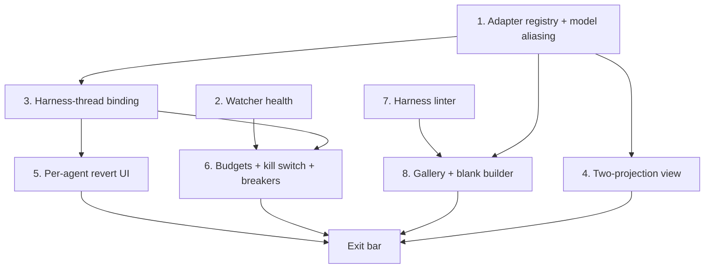

# Workstation Phase 2 — Implementation Specs (canonical order)

Distilled from a 4-designer (dependency-graph / risk / tracer-bullet / product lenses) +
2-judge workflow (2026-07-06; both judges independently selected the dependency-graph
design, with grafts from the runners-up folded in below), grounded in four disk-verified
investigation dossiers (symlinked-parent hardening — landed as `660dc56` / contracts
v1.1.5; agentId authority; watcher health; Phase-2 seam map). Each step is one grabbable
unit of work ending in a green `npm run check` and a main commit (repo convention: no
feature branches; full pre-commit gate). Contracts: `01-interface-contracts.md` v1.1.5.
Every file:line below was disk-verified at `660dc56` (the `harness-service.ts` anchors
re-verified after that commit's own hardening shifted the file) — **re-verify with `rg`
against disk before editing**; steps land sequentially and move each other's code (and
this repo has used git skip-worktree bits: check `git ls-files -v` before trusting a
silent Write).

**Phase 2 scope (PLAN.md, binding — do not re-litigate):** template gallery (~5) + blank
builder; adapter registry (Claude Code, Codex, Gemini + raw-CLI fallback); model
aliasing; two-projection agent view (structured thread ⇄ raw PTY); budget stack + kill
switch + circuit breakers; harness linter; per-agent revert UI. Exit bar: create a
non-template agent from blank in <5 min; kill switch halts a runaway loop; harness
linter flags a broken scope contract.

**Recorded interpretation (judge hazard, resolved here):** PLAN's "kill switch halts a
runaway *loop*" predates the phase split — Loops are Phase 3. For Phase 2's exit bar,
*runaway loop := runaway turn/agent* (a scripted write-loop turn). The Phase-3 loop
scheduler inherits the same kill/breaker machinery; this interpretation is recorded so
the exit bar is not quietly weaker than PLAN's sentence.

**Recorded decision (OQ1, amends contracts §4 at step 1):** adapter-native permission
hooks (Claude Code `--permission-prompt-tool` → HitlGate) are **deferred out of Phase
2's step list** to a dedicated follow-on. PLAN's Phase 2 scope list does not include
them; only Claude Code documents the mechanism; and the runaway-containment exit bar is
met by kill switch + breakers + watcher health. The deferral costs one reserved optional
capability field on `AgentAdapter` (step 1), and the landing stays cheap later:
`QueueHitlGate implements HitlGate` and `enqueueGateConfirm` are built, unit-tested, and
deliberately unwired since Phase 1 step 3. The §4 "Phase 2+ enforcement path" line and
02-phase-1-specs.md's residual ("adapter-native hooks are Phase 2") are amended in step
1's commit so the deferral is explicit, not silent re-litigation.

Cross-step rules:

- Use the `TE_DIR` constant everywhere; a hardcoded `.machina` is a bug except inside
  `HARNESS_PROTECTED_GLOBS`. Files under 800 lines. `thread-store.ts` is at ~830 lines —
  route around it (new small stores, not growth).
- Any deliberate deviation from the contracts amends `01-interface-contracts.md` in the
  same commit. Version plan: one minor bump to **v1.2 at step 1** (the §3 promotion is
  the structural change), then v1.2.x patch entries per landing step in §8, mirroring
  Phase 1's v1.1.x discipline.
- `ipc-channels.ts` / `preload/index.ts` / `main/index.ts` additions append-only at file
  end (parallel-session rule).
- **Doc reconciliation is part of each step, not the phase close** (judge hazard): a step
  that adds a subsystem (health model, binding registry, breaker, linter) updates
  CLAUDE.md's relevant section in the same commit and syncs AGENTS.md with
  `npm run sync:agents` (a deterministic byte-identical mirror — never hand-edit, never
  Codex; the Codex regen was retired at step 1 as pure ceremony). Phase close adds a full
  doc-reconciliation pass (overview, safety-subsystem, HANDOFF).
- **Parallel-session map** (dependency-graph lens, judge-verified, tightened by the
  verify pass): **only 1∥2 and 4∥7 are parallel-safe** (disjoint files; only append-only
  hotspot ends collide — latecomer rebases trivially). Every other pair is sequential in
  canonical order; the named collisions: 3 after 1 and 3 vs 4 (all edit
  `cli-thread-spawner.ts` + `ipc/cli-thread.ts`); 5 vs 7 (`palette-sources.ts`); 6 vs 7
  (`harness-service.ts` listHarnesses); 6 vs 8 (`harness-types.ts`); 2/3/5/6 all touch
  `ApprovalsTray.tsx`.
- Safety invariants (PLAN): parity direction only; verify.sh stays agent-inaccessible;
  queue-all-writes immutable default (PLAN Q9); UI copy never claims writes are blocked.
- Dev-app smoke checks are Claude-driven; Electron visual verification is Casey
  observing the running app — no programmatic Electron screenshots.

## Step 1 — Adapter registry + session-types + model aliasing (+ raw fallback)

> **DONE** (`18cc29d`, 2026-07-06, contracts v1.2). Spike-verified flags: `claude
> --model` / `codex -m` (exec + exec resume) / `gemini -m`; gemini ships `models: []`
> (no auth on the dev machine to verify ids — widen the roster only with a real spike).
> Golden byte-exact invocation tables + built-app probe (real `--model` acceptance,
> gemini reply-mirroring guard) are the regression harness. `cli-raw` thread input is
> disabled until step 8's templates (OQ3).

Land contracts §3 as code: `AdapterId`/`AgentAdapter`/`WorkstationSession`/
`SessionProjection` in a new `session-types.ts`, with an adapter registry that absorbs
the `formatCliInvocation` switch (`cli-thread-spawner.ts:63-96`), the bridge's
hard-coded structured-output predicate and extract functions
(`cli-agent-thread-bridge.ts:172-174`, `:225`, `:267-313`), and per-adapter model lists.
Model aliasing is merged into this step deliberately: the models list is a registry
field and the model flag is emitted by `formatInvocation` — the exact switch the
registry replaces; two commits would rewrite the same switch twice. Make `Thread.model`
real for CLI threads (vestigial today — seam map §2: `setThreadModel` is a no-op for CLI
threads at `thread-store.ts:93-94,433`, and `harness-run.ts:85-90` passes
`DEFAULT_NATIVE_MODEL` as filler) and add the `raw` fallback adapter (no parser, no
resume, PTY-only projection — PLAN Q8's "unknown CLIs work day one").

**Contracts:** §3 flips from "Phase 2 target" to landed (v1.2). Records: the
`cli-agent-session-types.ts` name-collision cross-reference (that module is CLI-agent
*presence* types, unrelated — seam-map trap); `AgentAdapter.formatInvocation(prompt,
opts incl. model?)`; `raw` semantics (no parseEvent, no resume, invocation source per
OQ3); a reserved optional permission-hook capability field (the OQ1 deferral seam); the
gemini nuance restated (a heuristic parser exists in `cli-agent-parsers.ts` — "absent
parseEvent = raw projection" is the *bridge* contract, not the file). §4's "Phase 2+"
line amended per the recorded OQ1 decision.

**Model-flag trust rules (judge grafts, binding):**
- A model flag is emitted ONLY for an explicit user pick validated against
  `adapter.models`; anything else — absent, unknown, or the persisted
  `DEFAULT_NATIVE_MODEL` filler that every existing CLI thread carries — falls back to
  the adapter default with no flag plus an audit note. A codex thread must never emit
  `-m claude-sonnet-4-6`.
- Flag syntax per adapter is **spike-verified against the installed CLIs before
  landing** (5-minute terminal spike: `claude --model` / codex / gemini equivalents — do
  not trust training data), and the exit bar includes one real-invocation smoke per
  adapter, because a probe asserting the block command *contains* the flag proves string
  construction, not CLI acceptance (judge hazard).

**New:** `src/shared/session-types.ts` (§3 shapes verbatim; header cross-reference to
`cli-agent-session-types.ts`); `src/shared/agent-adapters.ts` — `ADAPTERS:
Record<AdapterId, AgentAdapter>`: `formatInvocation` moved from
`cli-thread-spawner.ts:63-96` (per-adapter resume logic, `singleQuote`,
`SAFE_AGENT_SESSION_ID_RE`) plus the model flag; `parseEvent` lifted from the bridge's
`extractClaudeEvent`/`extractCodexEvent`; `models` per adapter; a `raw` entry with
neither parser nor resume. Pure and renderer-importable like `cli-agents.ts`.

**Edits:** `cli-thread-spawner.ts:63-96` (delegate to ADAPTERS; model threaded from
spawn/input requests); `cli-agent-thread-bridge.ts:172-174` (`supportsStructuredOutput`
becomes `!!adapter.parseEvent`), `:225` (adapter dispatch), `:267-313` (moved to
shared); `src/shared/cli-agents.ts:53-81` (`raw` CLIAgentSpec + `AgentPicker.tsx`
widened); `ipc-channels.ts` (optional `model` on cli-thread:spawn/input request shapes —
shape edit precedented by Phase 1 step 1's required `cwd`; new channels appended at file
end); `thread-store.ts:93-94,433` (un-no-op `setThreadModel` for CLI threads — a
sanctioned small touch, nothing else grows); `agent-transport.ts` (send `thread.model`);
`ThreadInputBar.tsx:146` (model options from `adapter.models` for CLI threads);
`harness-types.ts:30-39` (`identityForAdapter` re-based on `AdapterId`, kept as
re-export; `HARNESS_ADAPTERS` widening deferred to step 8);
`src/main/ipc/cli-thread.ts:26-35` — the spawn/input handlers destructure named request
fields and pass them positionally, so they must forward the new `model` field into the
spawner (verify-pass finding: a new request field is dead without this edit);
**type/persistence shape gaps (Codex cold-read findings, unlisted before):**
`src/shared/agent-identity.ts:1-3` — `AGENT_IDENTITIES` gains the raw identity (the
spawner's identity validation at `cli-thread-spawner.ts:23-28,68-70` rejects non-CLI
identities today, so `raw` is dead without this widening); `thread-md.ts:55-64` —
`encodeThread` omits `model` for non-`machina-native` threads, so a CLI thread's picked
model would not survive relaunch — persist it (round-trip test below).

**Tests:** **golden byte-exact invocation tables** (every adapter × fresh/resume ×
default/explicit model → exact command string — the registry-refactor regression
harness; today's three adapters with no model set must be byte-identical to current
output); parseEvent parity (existing bridge extraction tests ported against the shared
functions); gemini has no parseEvent, raw has neither parser nor resume; the
set-to-filler regression (thread whose persisted model is the `DEFAULT_NATIVE_MODEL`
filler emits NO flag); transport forwards model; setThreadModel persists for CLI
threads AND the model round-trips through thread-md encode/decode for CLI threads;
picker renders per-adapter lists.

**Exit:** full gate (check + build + e2e — renderer and main both move). Playwright
probe on the built app: cli-claude thread with an explicitly picked non-default model ⇒
block command carries the flag AND the reply still arrives (real-invocation
acceptance); a gemini thread still mirrors replies (bridge-dispatch regression guard —
the Phase-1 step-6 lost-reply lesson); `rg` confines `formatCliInvocation` to the
registry. Casey-observed: model picker live on a CLI thread; a raw session opens as a
plain PTY with honest "no structured view" copy.

**Risks:** bridge dispatch regression silently losing CLI replies (reply detection is
fragile — parity tables + the gemini probe are the guards); resume-flag interactions per
adapter; `cli-thread-spawner.ts` is also step 3's surface — steps 1 and 3 are strictly
sequential.

## Step 2 — Agent-write-watcher health model

> **DONE** (`be07439`, 2026-07-06, contracts v1.2.1). Recorded deviations (§8): turn
> tagging via a late-bound `setGateHealthProbe` on CliTurnRegistry instead of widening
> `TurnStartedOpts` (keeps the step-3-owned spawner untouched); the one-time thread
> notice latches on inFlight∧unhealthy (a deliberate superset of turn-start-unhealthy);
> `restartWatcher` carries a generation-counter guard against restart×workspace-switch
> races. Built-app probe `e2e/watcher-health.spec.ts` executed green. Casey-observed
> dev-app degraded-banner check still pending.

Give the containment watcher the health surface the item-4 dossier specs: a state
machine (`starting/watching/degraded/down/stopped`) exposed over IPC, honest degraded UI
in the ApprovalsTray, restart with backoff that preserves the queue, and hardening of
the three silent death paths — chokidar `error` is console-only
(`agent-write-watcher.ts:167-172`); a `handleBatch` throw inside EventBatcher's
setTimeout (`event-batcher.ts:59-72`) is an **uncaught main-process exception**, and the
voided `autoReject` promise at `:220` discards rejections; init failure is swallowed at
`main/index.ts:227-234` while the un-timed ready await (`agent-write-watcher.ts:173-174`)
can hang vault init. Today a workspace can be fully live with CLI agents runnable while
the containment watcher is dead and the only signal is a main-process console.error —
invisible in a packaged app. "Containment + visibility" with zero visibility into its
own death is a self-contradiction (honest-copy principle, contracts §4).

**Contracts (v1.2.x):** §4 watcher-health contract — five states + payload;
restart-preserves-queue rule (same-root `restartWatcher` must NOT call
`getApprovalQueue().clear()`, which `initApprovalsForRoot` at `ipc/git.ts:154-169` does —
the clear-on-init behavior stays load-bearing for root-binding on workspace switch);
recovery audit entry recording the coverage-gap window (escapes logged, never silent);
turn-start policy = **visibly degrade, never block** (OQ6, recorded product decision).
§6 gains `approvals:watcher-health` (event), `approvals:watcher-status` (invoke), and
`approvals:watcher-retry` (invoke — the channel behind the tray Retry action; judge
graft). `PendingChangeFlags` gains `gateDegraded`, with a **flag-taxonomy table**
reconciling it against the existing `degradedAttribution` and step 3's
`attributionSuspect` (judge hazard): `degradedAttribution` = hooks absent, PTY-alive
window attribution; `gateDegraded` = turn opened while watcher state ∉ {watching};
`attributionSuspect` = agentId failed main-side binding validation. A fully-down watcher
window captures no writes at all — the recovery audit gap entry is the real evidence
there, and the §4 amendment says so.

**New:** none (the health model lives in the watcher + ipc/git wiring).

**Edits:** `agent-write-watcher.ts` — `onHealthChange` dep (extend
`AgentWriteWatcherDeps:110-126`); race ready vs error vs ~30s timeout in `start()`
(fixes the vault-init hang); try/catch around the `handleBatch` body (`:204-267`) →
audit (reuse the `decision:'error'` pattern `:314-323`) + degraded, keep processing;
`.catch` the voided autoReject (`:220`). `ipc/git.ts:43-45,150-169` — wire
`onHealthChange`, broadcast health, factor `restartWatcher()` (watcher-only rebuild,
queue untouched) with exponential backoff (1s/5s/30s, cap 5, then down-until-manual);
`approvals:watcher-retry` handler invoking it. `main/index.ts:227-234` — the catch sets
state `down` (workspace stays live, per policy). `ipc-channels.ts` + `preload/index.ts`
— the three channels, appended at file end. `approvals-store.ts:72-76` — `watcherHealth`
via module-level subscription. `ApprovalsTray.tsx` — warning badge + banner when state ∉
{watching, stopped} with honest §4 copy ("Write containment is not watching. Agent
writes since <time> are not being captured for review.") + Retry action.
`cli-turn-registry.ts` — tag turns opened while unhealthy; flag plumbing through
`approval-queue.ts:71-83` merge + `approval-flags.ts` chip. `git-types.ts` —
`PendingChangeFlags.gateDegraded`. **Thread-surface signal (item-4 dossier reqs 5/6a,
restored by the verify pass):** a compact degraded chip on active CLI thread panels plus
a one-time inline thread notice when a turn starts while state ∉ {watching} — the tray
is not where the user is when it matters.

**Tests:** the item-4 dossier's list verbatim: state transitions; ready-timeout → down +
vault init completes; handleBatch throw caught/audited/degraded/next-batch-processed;
autoReject rejection caught; backoff schedule + cap + manual reset; **same-root restart
preserves queue vs workspace-switch clears** (mutation-tested — the two paths must be
genuinely separate); recovery audit gap-window entry; store subscription; tray banner +
Retry render (Retry invokes `approvals:watcher-retry`); thread-panel degraded chip +
one-time inline notice (component tests); degraded turn tagging; the
real-chokidar integration case (close watcher underneath → down → restart → post-recovery
writes queued).

**Exit:** full gate. **Standardized verification posture (judge hazard):** chokidar
death is not honestly scriptable in the packaged app — the real-chokidar integration
test carries the recovery evidence, component tests carry the UI, and the built-app
probe asserts only what it can force: `approvals:watcher-status` returns `watching` on
healthy boot, and a forced init failure (unreadable root fixture) leaves the workspace
live with state `down`. No exit claim of a packaged-app degradation demo.
Casey-observed: the degraded banner + Retry in the running dev app when Claude triggers
a simulated watcher failure (Claude drives the trigger).

**Risks:** restart/backoff timers vs workspace switches (`stopApprovals` is the FIRST
await in `reconfigureForVault` — a pending backoff retry must be cancelled on stop or it
rearms against a dead root). Parallel-safe with step 1 except append-only hotspot ends.

## Step 3 — Main-side harness↔thread binding + harness:run (attribution authority)

> **DONE** (`4047d35`, 2026-07-06, contracts v1.2.2). Recorded deviations (§8): the
> renderer creates the thread WITHOUT agentId and persists the slug only after main
> records the binding (refusal — including a thrown, non-structured rejection — deletes
> the just-created thread: net "no thread created"); a `harness:binding` read channel
> was added (the main-binding-sourced identity chip needs a read path); the backfill is
> one-time PER ROOT with a persistent `backfilledRoots` marker (re-running would
> re-trust tampered frontmatter every relaunch); `git:revert-agent` needed NO code
> change (the existing trailer walk already is the enumeration authority — a test pins
> `no-commits-for-agent`); orphan bindings for deleted threads accepted. Adversarial
> review hardening folded in pre-landing: registry failures degrade-not-fail
> (`registry-error` reason; a tolerant per-file thread scan so one malformed file in
> the watcher-ignored threads dir cannot DoS every harness turn), serialized mirror
> persists, NUL-delimited binding key + SAFE_ID threadId validated at the mint
> boundary, reserved (adapter-identity) slugs refused at create/run/backfill. Built-app
> probe executed green (real `claude` turns, throwaway repo): happy path ⇒
> `Machina-Agent: probe-fixer` trailer; frontmatter tamper ⇒ adapter-identity trailer,
> `cli-agent:attribution-mismatch` audit line (`reason: binding-mismatch`,
> `boundSlug: probe-fixer`), Attribution-suspect tray chip,
> `revertAgent('evil-agent')` ⇒ `no-commits-for-agent` while the true slug reverted
> cleanly with `Machina-Reverts`. Casey-observed harness-identity chip check still
> pending.

Close the item-3 dossier: `agentId` is renderer/disk-supplied end-to-end
(`thread-md.ts:63,105` persists/reloads frontmatter `agent_id`;
`agent-transport.ts:102,115` re-sends it every spawn/input;
`cli-thread-spawner.ts:152,183,216-218` consumes it unvalidated), main validates format
only (SAFE_ID_RE, at commit/revert time), and the tamper channel — `<TE_DIR>/threads` is
watcher-ignored by design (`agent-write-watcher.ts:46,153`) — is silent: a one-line
frontmatter edit reassigns all future commits and corrupts `revertAgent` scope. Move
harness-run composition into main (new `harness:run` IPC), record a **write-once
threadId→slug binding** in a main-owned registry persisted under userData, and validate
at turn attribution with degrade-not-fail semantics. This step is the HARD REQUIREMENT
gating step 5, and its binding snapshot is the trust anchor for step 6's budgets.

**Contracts (v1.2.x):** §4 attribution-authority subsection — HarnessRunRegistry
(write-once per threadId, persisted keyed workspace root + threadId; acknowledged
residual: a user-level agent could theoretically reach userData — same class as trailer
forgery; accident containment, not a boundary). Mismatch / unknown slug / agentId on an
unbound thread ⇒ degrade to adapter identity + audit `cli-agent:attribution-mismatch` +
`PendingChangeFlags.attributionSuspect`. **Legacy threads (judge graft, reconciled
by the verify pass):** pre-binding threads DO actively forward their persisted agentId —
v1.1.3 deliberately re-sends `Thread.agentId` on every spawn/input
(`agent-transport.ts:102,115`), so "legacy" and "unbound forward" are the same predicate
and a bare exemption would contradict the flagging rule. The resolution is a **one-time
trust-on-upgrade backfill**: at this step's first load, every existing thread whose
persisted `agent_id` names an existing harness directory gets a binding backfilled
(audited `cli-agent:binding-backfill`); after the backfill, ANY forwarded agentId on an
unbound thread flags. This step supersedes v1.1.3's
frontmatter-persistence-as-attribution-source (cite v1.1.3 explicitly in the §8 entry). Frontmatter `agent_id`
demoted to display-only (decode kept for UI titles). `git:revert-agent` id validation =
**trailer enumeration, not registry membership** (judge graft, explicit deviation from
the item-3 dossier's req 4): the git-log trailer walk is the authority, so commits from
pre-binding history, deleted harnesses, or a wiped userData stay revertable; post-binding,
forged slugs can no longer *enter* trailers via Machina's own path, and forged-by-shell
trailers remain the accepted §4 forgery residual. §6 gains `harness:run`. v1.1.5
residual #1 (read/exec-time realpath re-check) is discharged here and marked with a
dated status line.

**New:** `src/main/services/harness-run-registry.ts` (write-once Map threadId→{slug,
workspaceRoot} + persisted mirror in userData, loaded before the first cli-thread input
after relaunch; reserved budgets-snapshot field for step 6);
`src/main/services/harness-run.ts` (main-side composition: read
SKILL.md/rules.md/scope.json/state.md via harness-service WITH the v1.1.5
realpath-equality re-check, `buildHarnessPrompt` (shared, exists), record binding,
return { prompt }). **Ownership split (Codex cold-read finding, resolved):** thread
creation is NOT moved main-side — it is split today between `thread-ipc.ts` and
`thread-store.ts:300-318` and the renderer transport start depends on it; moving it
would fork lifecycle ownership. Instead the renderer creates the thread exactly as
today, then calls `harness:run` with `{ slug, threadId }`; main validates the slug
(realpath re-check), composes the prompt, records the write-once threadId→slug binding,
and returns the prompt; the renderer keeps the send. Binding authority is preserved:
main records a binding only after ITS OWN validation, and later turns validate the
forwarded agentId against it.

**Edits:** `ipc/harness.ts` (harness:run handler, root main-side); `ipc-channels.ts` +
`preload/index.ts` (appended); `renderer/store/harness-run.ts:42-96` — slims to invoke
`harness:run` then keep the renderer-side `waitForNewShellPrompt` + `appendUserMessage`
dance UNCHANGED (the fresh-PTY readiness wait uses block-store; moving the send into
main would re-open the Phase-1 step-6 lost-reply failure — deliberate split: main owns
binding + composition, renderer owns send timing); `ipc/cli-thread.ts:26-35` —
SAFE_ID_RE at the IPC boundary + binding lookup (match ⇒ proceed; mismatch/unknown ⇒
degrade + audit + flag; never hard-fail the turn);
`cli-thread-spawner.ts:152,183,216-221` — attribution consumes the validated value;
`git-types.ts` — `attributionSuspect` + queue merge + tray chip; **flag propagation
path (Codex cold-read finding — it does not exist today and must be built, not
assumed):** `cli-turn-registry.ts:73-85` — `TurnStartedOpts` and the `ActiveTurnMatch`
result both gain `attributionSuspect`, set at `turnStarted` when validation degraded;
`agent-write-watcher.ts:249-254` — the existing flag-assembly site merges it into
`PendingChangeFlags` exactly as `concurrentTurns`/`degradedAttribution` flow today; `ipc/git.ts:190-194` —
revert-agent validates against trailer enumeration (unknown ⇒ structured error);
`thread-md.ts:63,105` — doc comment demoting agent_id to display-only. **Judge graft:**
a main-binding-sourced harness-identity chip on the thread header (the visible
affordance proving attribution authority landed — binding value, not frontmatter).

**Tests:** the item-3 dossier's list verbatim: happy path preserved (bound thread ⇒ slug
trailer + correct revert scope); frontmatter tamper repro (rewrite `agent_id` x→y,
reload, send ⇒ adapter identity not y, audit entry, attributionSuspect flag);
`revertAgent('y')` post-tamper finds nothing from that thread while `revertAgent('x')`
keeps pre-tamper commits; unbound ad-hoc thread unchanged; forwarded agentId on an
unbound thread ⇒ degrade + flag; **pre-binding legacy thread with a real harness agent_id ⇒ backfilled binding, slug
attribution preserved, NO flag, backfill audit entry; legacy thread whose agent_id
names no harness dir ⇒ degrade + flag** (judge graft as reconciled); binding survives
relaunch and is write-once; malformed agentId rejected at
spawn/input; revert-agent unknown id ⇒ structured error; partitionBatch unchanged
(`<TE_DIR>/threads` stays out of the queue — the fix is authority, not surfacing thread
churn); realpath-equality regression (symlinked agents dir ⇒ harness:run refuses,
no thread created).

**Exit:** full gate. Playwright probe on the built app: the tamper repro end-to-end
(edit `.machina/threads/<id>.md` agent_id, relaunch, send turn ⇒ approved commit trailer
is the adapter identity, `cli-agent:attribution-mismatch` NDJSON audit line present,
tray shows the Attribution-suspect chip); happy-path harness run still produces
`Machina-Agent: <slug>`. Casey-observed: the harness-identity chip on a bound thread.

**Risks:** relaunch ordering (the persisted mirror must load before the first
cli-thread:input or the first post-relaunch turn degrades falsely — test covers it);
harness-run behavior parity (keeping the send renderer-side is the mitigation — do not
"simplify" it into main); strictly sequential after step 1; ApprovalsTray touch collides
with step 2 — sequential.

## Step 4 — Two-projection agent view (structured thread ⇄ raw PTY)

> **DONE** (2026-07-07, contracts v1.2.3, landed on `wip/p2-step4` for the
> orchestrator's post-merge reconciliation). Recorded deviations (§8): (1) the
> webview-guest connect decision (reconnect → reattachOnly dead-stop → create) was
> EXTRACTED to `src/renderer/terminal-webview/connect-session.ts` instead of edited
> inline in `TerminalApp.tsx` — the load-bearing "no terminal:create at the webview
> layer" test is only behaviorally pinnable against a pure api-injected function;
> TerminalApp's source-string tests were updated to pin the delegation (and that
> `window.terminalApi.create` no longer appears in TerminalApp at all); (2) the
> adapter's read-only dead state also covers a PTY that exits UNDER a live raw view
> (`session-exited` in projection mode), not just stale-at-mount; (3)
> `cli-thread:get-session` responds `{ sessionId, live } | null` (liveness from the
> existing `hasLiveSession` probe) so the dead state needs no second channel; (4) in
> projection mode the adapter also OMITS `cwd`/`vaultPath` from the webview URL
> (belt-and-suspenders beyond the spec's reattachOnly param: nothing in the URL may
> create, and nothing says where). All specced tests landed, including the
> block-protocol integrity pair (echoed keystrokes interleaved into the running agent
> block + a user-run non-agent command block mid-turn: turn completes once, reply
> mirrors, no early close). The built-app Playwright probe
> (`e2e/agent-projection.spec.ts`) is WRITTEN but NOT executed in this session
> (parallel-session e2e collision rule) — the orchestrator runs it post-merge; it
> uses a direct `cli-thread:input` echo turn rather than a harness turn so it does
> not depend on an installed/authed CLI. Casey-observed one-click flip on a live
> harness run still pending.

One click between the structured thread and the live raw PTY (PLAN Q8). The plumbing gap is
precise (seam map §3): `cli-thread:spawn` RETURNS `sessionId` (`ipc-channels.ts:277`)
but `cliTransport.start` drops it (`agent-transport.ts:96-104`);
`CliThreadSpawner.getSessionId` (`:250-252`) has no IPC caller; the
`metadata.sessionId` leak (`cli-agent-thread-bridge.ts:321,334`) arrives only after the
first block and goes stale on respawn. Add authoritative sessionId plumbing plus a
projection toggle, with the hard rule that a dead agent PTY renders a dead state and
NEVER respawns a fresh shell in the thread's cwd (an unattributed shell would be a
containment hole).

**Contracts (v1.2.x):** consumes §3 SessionProjection/WorkstationSession. §6 gains
`cli-thread:get-session` + `cli-thread:session-changed`. The dead-PTY no-respawn rule
for agent projections stated as a contract point (the webview's stale-session respawn is
correct for plain terminals, forbidden for agent projections). **Interactive-input
residual named honestly (judge hazard):** the raw view is the user's PTY — keystrokes
during an open turn flow through the same shell-hook block → bridge path as agent
output; a user-typed command whose first token matches a CLI binary can be mirrored as
an agent reply (`detectAgentFromCommand`) and interacts with turn-window open/close
counting. Phase 2 documents this (same trust level as today's dock terminal), adds the
block-protocol integrity test below, and the §4 copy states raw-view input is attributed
to the thread's turn windows.

**New:** `src/renderer/src/store/cli-session-store.ts` — threadId→sessionId + liveness;
seeded from spawn responses, updated by the session-changed event; deliberately a new
small store so `thread-store.ts` is untouched.

**Edits:** `agent-transport.ts:96-104` (keep sessionId from the spawn response);
`cli-thread-spawner.ts` (`onSessionChanged` fired on the spawn-on-demand respawn path
`:175-189`; `getSessionId` exposed via IPC); `ipc/cli-thread.ts` (get-session handler);
`ipc-channels.ts` + `preload/index.ts` (appended); `ThreadPanel.tsx` (projection toggle
in the thread header); `TerminalDockAdapter.tsx:30-96` (projection-mode prop:
reattach-only; on stale/dead session render read-only dead state). **The no-respawn
rule cannot be enforced from the adapter alone (Codex cold-read finding): the webview
itself falls back to `terminal:create` when reconnect returns null
(`TerminalApp.tsx` connectSession — reconnect path then create path), independent of
the host adapter.** So: a `reattachOnly` param added to the pure URL builders in
`terminal-webview-src.ts` (keep param names in sync with `TerminalApp.readUrlParams` —
the Phase-1 step-4 rule), read by `TerminalApp.tsx`'s connectSession to skip the create
fallback and report a dead state to the host instead.

**Tests:** transport retains sessionId; session-changed fires on respawn and updates the
store; get-session round-trip; projection-mode dead session ⇒ NO `terminal:create` call
**at BOTH layers — adapter suppression and the webview's reattachOnly URL-param path**
(load-bearing assertion, same style as Phase-1 step 4's no-kill-on-detach tests); toggle
component; store seed/update/liveness; **block-protocol integrity with interleaved human
input** (judge hazard): user-typed bytes into the raw view mid-turn do not corrupt block
detection or close the turn window early — assert the turn still completes and the reply
still mirrors.

**Exit:** full gate + e2e. Playwright probe on the built app: run a harness turn, toggle
to raw ⇒ the webview attaches to the SAME PTY (ps/lsof shows one shell for the thread;
ring-buffer replay shows the turn's output), toggle back ⇒ structured thread intact;
kill the PTY ⇒ raw side shows dead state and ps confirms no respawn. Casey-observed: the
one-click flip on a live harness run, scrollback present both ways.

**Risks:** two sessionId sources (spawn response vs bridge metadata) — the new event is
the single authority; the metadata path stays untouched but must not feed the store.
Parallel-safe with step 7.

## Step 5 — Per-agent revert UI + list-agent-commits

Retire the last Phase-1 residual: `revertAgent` is backend-complete (channel
`ipc-channels.ts:322-325`, handler `ipc/git.ts:190-194`, preload `index.ts:220`) with
ZERO renderer callers and no enumeration IPC — the exact gap named in HANDOFF's
definition-of-done record. Extract a read-only `listAgentCommits` from the existing
trailer log-walk (`git-service.ts:384-402` — same single git-log invocation, group
instead of filter), and surface revert in the ApprovalsTray popover (the established
git-consequences surface — OQ5) plus palette entries, behind a confirm dialog with honest
copy.

**Contracts (v1.2.x):** consumes step 3's trailer-enumeration validation — shipping this
UI before the binding would put a one-click destructive action on a spoofable id, which
is why item 3 hard-gates this step. §2 GitService gains `listAgentCommits`; §6 gains
`git:list-agent-commits`.

**New:** `src/renderer/src/panels/agent-shell/RevertAgentSection.tsx` — tray popover
section: agents with revertable commits (agentId, count, last subject/date), Revert with
confirm; handles both id shapes (harness slug or adapter identity fallback); **includes
trailer-enumerated ids that are not registry-known** (judge graft — commits from a
since-deleted harness stay revertable).

**Edits:** `git-service.ts:384-402` (factor the log walk into a shared enumerator;
`listAgentCommits(root): { agentId, shas, lastSubject, lastDate }[]` excluding shas
already named in any Machina-Reverts trailer); `ipc/git.ts` (handler, root from
WorkspaceService, never renderer-supplied); `ipc-channels.ts` + `preload/index.ts`
(appended); `ApprovalsTray.tsx` (mount the section, collapsed by default);
`palette-sources.ts:237-248` ("Revert harness: <slug>" entries gated on non-empty
commit list).

**Tests:** listAgentCommits grouping + Machina-Reverts exclusion + exact-match ids
(`fixer` ≠ `fixer-2`, reusing the step-2 test style); deleted-harness id still listed
and revertable; handler null-root structured error; component confirm flow; disabled in
non-repo workspaces; palette entries appear only for agents with revertable commits.

**Exit:** full gate. Playwright probe on a throwaway repo: commits from two agents ⇒
list groups both; UI revert of A ⇒ Machina-Reverts commit, B's commits intact (the
Phase-1 tracer assertion, now via UI); list refreshes to exclude reverted shas.
Casey-observed: reverting an agent's commit from the tray without touching the DevTools
console.

**Risks:** confirm-dialog copy must be honest per §4 framing (revert creates new
commits; it does not delete history and is not protection). Enumeration cost on large
histories — single bounded git-log (GIT_TIMEOUT_MS + maxBuffer already govern runGit).
Collides with 2/3/6 on ApprovalsTray and with 7 on palette-sources — sequential.

## Step 6 — Budget stack + kill switch + circuit breakers

Make the parsed-but-decorative budgets real (seam map §4: `MAX_WRITES_PER_MINUTE` is a
module constant at `agent-write-watcher.ts:35` — whose misleading "Contracts §5 default
budget" comment gets fixed in this step (judge graft) — never read from any harness;
`maxTurns` has no counting site) and deliver the runaway-containment exit bar. Budgets
snapshot into the step-3 binding at harness:run time; the watcher's per-thread limiter
threshold comes from the bound slug's budget; CliTurnRegistry counts invocations per
thread for maxTurns (OQ2); a breaker service escalates advisory signals to kill
(`spawner.close`, `cli-thread-spawner.ts:227-235`) within the §4 containment framing —
breakers contain accidents faster; they never claim prevention.

**Contracts (v1.2.x):** §5 budgets ENFORCED with defined semantics —
- `maxWritesPerMinute` = the limiter threshold, **per thread** (judge hazard resolved
  explicitly: `WriteRateLimiter` is keyed per thread at
  `agent-write-watcher.ts:133-134,297-300`, so N concurrent threads bound to one slug
  each get the full threshold; Phase 2 documents per-thread-per-slug semantics honestly
  rather than building aggregate accounting — Phase 3's loop scheduler is the natural
  home for per-slug aggregation, recorded as a residual with a concurrent-same-slug test
  documenting current behavior).
- `maxTurns` = CLI invocations per thread, counted at `CliTurnRegistry.turnStarted`
  (OQ2 — agent-internal iterations are invisible in the `--print` model and gemini/raw
  have no structured stream; Phase-3 loops are the primary consumer).
- **Budgets snapshot at bind time** (judge hazard named explicitly): SKILL.md
  frontmatter is agent-writable — `HARNESS_PROTECTED_GLOBS` covers only verify.sh and
  rules.md, so a running agent can edit its own budgets mid-run. Snapshot-at-bind is the
  mitigation: post-bind edits affect the NEXT run only. Widening the protected globs to
  SKILL.md is rejected for now (it would auto-reject the agent's legitimate state.md
  sibling-file workflow ergonomics and user edits alike) — recorded as an accepted
  residual with the tamper channel named.
- New breaker contract: trip inputs (velocity = N consecutive limiter windows, not one;
  repeated HARNESS_PROTECTED_GLOBS autoRejects per turn; headMoved audit; maxTurns
  breach), trip action = cli-thread:close + audit + `agent:breaker-tripped` event.
  **Negative rules (judge grafts):** the breaker never trips on watcher-degraded state
  alone (a dead watcher must not kill healthy agents), and never auto-kills on signals
  from writes flagged `concurrentTurns` (ambiguous attribution could kill the wrong
  agent — degrade to a tray notice instead; judge hazard). Kill switch = the existing
  hard-kill path surfaced. **Kill-vs-awaitWriteFinish semantics recorded:** writes
  flushing within the ~300ms awaitWriteFinish window after `spawner.close` become
  audited-unattributed (the zero-linger `threadClosed` trade) — documented and tested,
  not silent (judge graft).

**New:** `src/main/services/agent-circuit-breaker.ts` — keyed threadId/agentId; trip ⇒
injected kill callback (late-bound via the `setPtyAliveProbe` pattern,
`cli-turn-registry.ts:237` / `ipc/cli-thread.ts:17-21`) + audit + IPC event; consumes
step-2 health state (knows when its signal sources are down and says so rather than
pretending coverage). **Signal seam (Codex cold-read finding — no subscribe API exists;
the watcher calls queue methods directly and the queue's only callback is the
pending-count notify):** `AgentWriteWatcherDeps` gains an optional injected breaker port
(`noteVelocity` / `noteForbiddenAutoReject` / `noteHeadMoved`) invoked from the existing
flag-assembly and autoReject sites (`agent-write-watcher.ts:217-261`), and the registry
surfaces maxTurns breach via a callback wired in `ipc/cli-thread.ts` — the same
injected-dependency style as step 2's `onHealthChange`, wired in `ipc/git.ts`.

**Edits:** `harness-types.ts:93-98` (HarnessSummary gains budgets) +
`harness-service.ts:176-181` (the `summaries.push` construction inside listHarnesses
`:143-184` carries them — anchors re-verified post-`660dc56`); `harness-run-registry.ts` (budgets snapshot
at bind — the step-3 reserved field); `agent-write-watcher.ts:35,297-300` (limiterFor
takes threshold from an injected per-agentId budgets provider; default 10 for
unbound/ad-hoc; comment fixed); `cli-turn-registry.ts:118` (invocation counter per
threadId; breach surfaced to the breaker); `ipc-channels.ts` + `preload/index.ts`
(`agent:breaker-tripped` event + breaker-status invoke if the UI needs a pull,
appended); `ThreadInputBar.tsx` or ThreadPanel header (kill-switch button wiring
cli-thread:close + tripped/killed state); `ApprovalsTray.tsx` (breaker-tripped notice
row; **plus the workspace-switch visibility graft** — a one-line tray note when live
agent PTYs exist from a non-active workspace root, with per-thread manual kill via the
new kill machinery; this respects the recorded Phase-1 no-auto-kill-on-switch decision
while closing the honesty gap as agent count grows. **Severable (Codex cold-read
finding — OQ8 is a ratification gate, not an implementation detail): the graft lands
with step 6 only if Casey has ratified OQ8 by then; otherwise step 6 lands green
without it and the graft becomes its own small follow-up commit. The rest of step 6
does not depend on it.**).

**Tests:** per-slug threshold vs default (limiter trips at the harness's number, not the
constant); concurrent same-slug threads each get the threshold (documents the
per-thread semantics); invocation counter + maxTurns breach; breaker trip matrix
(velocity / repeated forbidden autoRejects / headMoved / maxTurns) ⇒ kill callback
exactly once + audit entry; **never-trip-on-degraded-alone negative test**;
**never-kill-on-concurrentTurns negative test**; budgets snapshot at bind (post-bind
scope.json/SKILL.md edit does not change the running thread's threshold); manual kill
wiring; tripped state renders; kill-then-flush window writes become audited-unattributed.

**Exit:** the PLAN exit bar under the recorded interpretation ("runaway loop" := runaway
turn/agent). Playwright probe on a throwaway repo: an agent turn running a scripted
write loop ⇒ velocity breaker trips ⇒ PTY dead (ps), audit entry, UI shows tripped;
manual kill halts a live turn mid-output. Full gate. Casey-observed: pressing kill on a
running agent visibly stops output in the running app.

**Risks:** false-positive trips on legitimate write bursts (codegen, scaffolding) —
per-harness thresholds make it tunable; start conservative and frame kills as
containment, not judgment. Killing mid-write leaves the pending queue item — fine, the
gate owns it, but test it. maxTurns is coarse by design (OQ2) — do not parse adapter
streams to count internal turns.

## Step 7 — Harness linter

> **DONE** (2026-07-07, contracts v1.2.4, branch `wip/p2-step7`). Recorded deviations
> (§8): `harness-store.ts` needed no textual change (diagnostics ride the widened
> `HarnessSummary`, which also gains `adapter: HarnessAdapter | null` for
> unreadable-frontmatter entries); presence lints share ONE `file-missing` code with
> the `file` field disambiguating, and missing rules.md/scope.json/state.md are flagged
> beyond the spec's enumerated fs lints (harness:run reads all four); invalid-slug dirs
> and stray files remain skipped (not addressable as harnesses); a symlinked agents dir
> now LISTS entries with `symlink-ancestry` errors, superseding v1.1.5's silent `[]`
> skip; `<dir>` placeholder leakage and verify.sh mode drift are WARNING severity
> (containment unaffected / defense-in-depth per §5) while scope-protected-globs,
> scope-unparseable, frontmatter-invalid, file-missing, and symlink-ancestry are errors
> and disable run; `runHarness` gained a defensive error-diagnostics guard mirroring
> the palette disable. `harness:lint` returns `[]` with no workspace (list semantics).
> Fresh `npm run check` (3372 tests) + `npm run build` green. The built-app probe
> `e2e/harness-lint.spec.ts` (exit-bar: strip protected globs on disk ⇒ lint violation
> + palette entry greyed/aria-disabled with reason, run inert) is WRITTEN but NOT
> executed — parallel sessions share the Electron support dir; the orchestrator runs
> it post-merge. Casey-observed flagged-harness check in the running app still pending.

The linter's job is everything create-time validation cannot see (seam map §5):
scope.json is never re-validated after create (hand-edits can strip
`HARNESS_PROTECTED_GLOBS` undetected — `validateHarnessScope` has no post-create
caller), verify.sh mode/presence drift is unchecked, malformed harnesses silently vanish
from the palette with no diagnostics (`harness-service.ts` skip-not-throw), and v1.1.5
residual #2 requires flagging symlinks in the agents ancestry. Pure content lints in
shared (renderer-importable, table-testable); fs lints (mode, symlink realpath)
main-side; skip-reasons surfaced instead of silent drops.

**Contracts (v1.2.x):** consumes §5 (schema) + v1.1.5 residual #2 (discharged here;
residual #1 was discharged in step 3). §5 gains the linter contract: `Diagnostic
{ severity, code, message, file }`, `harness:lint` in §6, `listHarnesses` returns skip
reasons.

**New:** `src/shared/harness-lint.ts` — pure `lintHarness(files) → Diagnostic[]`: scope
superset re-validation (`validateHarnessScope` reuse, `harness-types.ts:69-81`),
rules.md severity-tag format (the `- [severity] text` convention,
`harness-templates.ts:49-58`), `<dir>` placeholder leakage into materialized scope,
frontmatter name vs directory slug mismatch, frontmatter parse-failure reasons,
verify.sh shebang.

**Edits:** `harness-service.ts:143-184` (listHarnesses returns diagnostics/skip reasons;
main-side fs lints: verify.sh presence + mode 0555 drift, handoffs/ presence,
symlink-in-ancestry realpath check — agents dir or slug dir not canonicalizing to the
literal path ⇒ error diagnostic); `ipc/harness.ts` (harness:lint handler);
`ipc-channels.ts` + `preload/index.ts` (appended); `harness-store.ts` (diagnostics on
summaries); `palette-sources.ts:237-248` (broken harnesses greyed with reason, run
disabled on error severity — not vanished).

**Tests:** lint table per check, headlined by the exit-bar case (scope.json with
HARNESS_PROTECTED_GLOBS stripped ⇒ error diagnostic); mode drift (chmod 755 ⇒
diagnostic); missing verify.sh; symlinked agents dir ⇒ ancestry diagnostic; placeholder
leakage; name/slug mismatch; listHarnesses surfaces skip reasons; palette renders greyed
entry with reason; error severity disables run.

**Exit:** the PLAN exit bar: "harness linter flags a broken scope contract." Playwright
probe: hand-edit scope.json on disk to strip the protected globs ⇒ `harness:lint`
returns the violation AND the palette shows the harness flagged with run disabled. Full
gate. Casey-observed: a broken harness visibly flagged in the running app.

**Risks:** shared-vs-main lint split drifting (main composes shared lints + fs lints,
never reimplements); keep Diagnostic minimal — severity-taxonomy creep is the classic
linter failure. Zero upstream deps: parallel-safe with step 4; NOT with step 5
(palette-sources), step 6 (both restructure `listHarnesses`), or step 8 (its consumer).

## Step 8 — Template gallery (~5) + blank builder

Generalize the one hard-coded create path (`palette-sources.ts:217-232` — template id
AND slug literal `'test-fixer'`; the run side already generalizes per-harness — do not
rebuild it) into a gallery over `HARNESS_TEMPLATES` plus a blank builder. The builder
widens `harness:create` to `{ template?, slug, overrides? }` (OQ4) and re-runs
`validateHarnessScope` + `lintHarness` on the MERGED result before any write — the
refuse-to-emit invariant on user-supplied globs is the security-relevant line of this
step. **Scope decision (judge graft, sharpened by the Codex cold read — the union and the
refusal cannot share one path without a caller-intent signal, and the signal is the
presence of `overrides`):** when `overrides` are supplied (wizard or programmatic),
createHarness ALWAYS auto-unions `HARNESS_PROTECTED_GLOBS` into forbiddenGlobs before
validating — user input is never trusted to include them, and the constructive union
means a stripped-glob input still produces a compliant contract; template-only creates
(no overrides) keep Phase 1's refuse-to-emit semantics unchanged — a template missing
the protected globs is a template BUG and must fail loudly, not be silently repaired.
`validateHarnessScope` runs on the final scope in both paths as the belt-and-braces
assert.

**Contracts (v1.2.x):** §6 `harness:create` widened (OQ4 records the single-path
rationale — a second channel means two code paths that must stay invariant-equal
forever). §5 wizard rules: `permissionMode` immutable `'queue-all-writes'` (PLAN Q9 — the
wizard displays the ladder, it does not offer it); merged-scope revalidation mandatory;
user strings must round-trip the hand-rolled frontmatter parser
(`harness-types.ts:119-169` rejects multiline — reject, don't escape).
`HARNESS_ADAPTERS` widened to include `'raw'` per step 1 + OQ3.

**New:** `src/renderer/src/panels/agent-shell/HarnessGallery.tsx` — gallery (template
cards from HARNESS_TEMPLATES) + blank-builder form: slug, description, adapter (incl.
raw + its invocation template per OQ3), budgets, scope globs, verify command, rules —
PLAN's creation-wizard knobs; permissionMode shown fixed; **live lint feedback (judge
graft): the form previews `harness:lint` diagnostics on the would-be harness and
disables create while blocking diagnostics exist**, not submit-time-only validation;
knife-edge geometry, tokens only.

**Edits:** `harness-templates.ts:77-79` (~4 new entries — roster per OQ7, including
**raw-tool-runner** (judge graft) so PLAN Q8's "unknown CLIs work day one" is proven through
the creation flow, not just the picker; every entry must pass lintHarness — invariant
test); `harness-service.ts:50-133` (createHarness accepts overrides; merge → auto-union
→ validateHarnessScope + lintHarness BEFORE mkdir — the existing refuse-to-emit pattern
whose scope check sits at `:67`, and the write block + bounded partial-cleanup through
`:133` must be preserved; frontmatter round-trip guard on user strings); `ipc-channels.ts:341-344` (request
widened — shape edit, precedented) + preload; `palette-sources.ts:217-232` (hard-coded
action replaced by a template loop + "New agent…" gallery opener);
`harness-types.ts:22-23` (HARNESS_ADAPTERS + 'raw'). **Raw-harness dispatch
cross-reference (Codex cold-read finding):** a raw harness run depends on step 1 having
landed the registry's `raw` entry, the widened `AGENT_IDENTITIES`, and OQ3's invocation
template — `identityForAdapter` and the invocation path know only the three hard-coded
CLIs today, so raw templates ship in THIS step but execute through step 1's machinery;
the raw-tool-runner template's SKILL.md frontmatter carries the OQ3 template string.

**Tests:** the two-path scope rule — overrides with stripped protected globs ⇒ created
scope CONTAINS the protected globs (union) and validateHarnessScope passes on the
result; template-only create from a mutated template missing them ⇒ structured refusal,
NOTHING written (Phase 1 semantics locked); every shipped template lints clean (gallery-integrity invariant); frontmatter
round-trip for wizard strings (multiline/injection rejected); `<dir>` materialization on
custom scopes; gallery loop renders all templates; blank create produces six entries,
verify.sh last at 0o555 (reuse Phase-1 step-6 test shapes); builder disables create on
blocking lint diagnostics.

**Exit:** the PLAN exit bar: "create a non-template agent from blank in <5 min" —
Casey-observed TIMED run on the running app: blank builder → configured harness →
running on a real repo, under 5 minutes. Playwright probe: blank create with custom
scope ⇒ six entries on disk, lints clean, appears in palette; stripped-glob programmatic
attempt ⇒ refusal with nothing written; duplicate slug still refused. Full gate.

**Risks:** wizard scope creep — hold to PLAN's knobs (role, budgets, verifier, scope;
permission ladder display-only; triggers are Phase 3). Frontmatter injection via user
strings is the real hazard — the hand-rolled parser is the guard; reject anything it
cannot round-trip. Template quality is unproven until the harness proof method (PLAN
Verification, curriculum 14.41) runs against the roster — recorded as a phase residual,
not a gate. Edit-existing-harness is explicitly OUT (create never overwrites; new
semantics + re-lint — defer).

## Phase-2 exit bar (PLAN, with the recorded interpretation)

In one sitting on the running app: blank builder produces a working non-template agent
in under 5 minutes (step 8, Casey-timed); a scripted runaway turn is halted by the
velocity breaker and a live turn by the manual kill switch (step 6); a hand-broken scope
contract is flagged by the linter with run disabled (step 7); plus the carried
step-level bars — model-picked CLI turn round-trips (1), watcher death is visible +
recoverable (2 — via the recorded verification posture: dev-app simulated trigger +
integration-test evidence, not a packaged-app demo), frontmatter tamper cannot steer
trailers or revert scope (3), the
structured⇄raw flip preserves the PTY (4), and an agent's commits revert from the tray
(5). `npm run check` green at every step boundary; every PLAN invariant intact.

## Open questions (answers wanted before the affected step lands; recommendations are
the default if unanswered)

- **OQ1 — adapter-native permission hooks in or out?** Recommendation: OUT (deferred,
  reserved seam), recorded at step 1. Why: not in PLAN's Phase 2 list; only Claude Code
  documents the mechanism; exit bar doesn't need it; QueueHitlGate keeps the future
  landing cheap. Options: (a) defer with reserved seam — shippable phase, one optional
  field now, enforcement stays post-persistence another phase; (b) Claude-Code-only 9th
  step — real pre-write enforcement on one adapter, but asymmetric safety story + new
  MCP transport surface; (c) all adapters — a research spike, not a speccable step.
- **OQ2 — what does maxTurns mean?** Recommendation: CLI invocations per thread, counted
  at `turnStarted`, breach trips the breaker; Phase-3 loops named primary consumer. Why:
  the only honest observable in the `--print` model; gemini/raw have no structured
  stream. Options: (a) invocation count now — real counting site, Phase-3-ready, coarse
  for chatty threads; (b) defer entirely — budgets ship decorative again, the exact
  smell flagged; (c) parse adapter streams — adapter-specific, breaks model-agnosticism.
- **OQ3 — raw adapter invocation source?** Recommendation: single-line template string
  with `{prompt}` placeholder, per-harness frontmatter or per-session for ad-hoc,
  `singleQuote`-quoted, round-trip-validated; no resume, no parser. Options: (a)
  template string — general, loop-compatible, quoting mitigated; (b) binary+args array —
  no quoting ambiguity but clumsier and still needs a prompt-position convention; (c)
  pure type-it-yourself PTY — zero injection surface but harness/loops can never drive
  raw agents.
- **OQ4 — widen harness:create or add a second channel?** Recommendation: widen to
  `{ template?, slug, overrides? }`. Why: the refuse-to-emit invariant lives in exactly
  one place; a second channel is an invariant-drift generator. Options: (a) widen —
  single validated path, precedented shape edit; (b) new channel — pure append-only but
  duplicated validation forever.
- **OQ5 — where does revert live?** Recommendation: ApprovalsTray section + palette;
  skip the thread header. Why: the tray is the git-consequences surface with the honest
  copy colocated; a thread-header button lies about scope (an agentId spans threads).
  Options: (a) tray + palette; (b) palette-only — undiscoverable, no commit preview
  before a destructive-adjacent action; (c) thread header — contextual but scope-confusing.
- **OQ6 — block or degrade when the watcher is down?** Recommendation: visibly degrade,
  never block; gateDegraded flag + banner + Retry; no strictness toggle this phase. Why:
  §4 says the gate is not a security boundary — blocking buys no protection and turns fs
  flakes into outages; the sin is implying protection that is not live. Options: (a)
  degrade — consistent, no denial, gap window audited; (b) block — fake safety, outages;
  (c) per-window confirm toggle — ceremony for marginal honesty, revisit on demand.
- **OQ7 — gallery roster?** Recommendation: test-fixer + bug-reproducer (writes ONE
  failing test then stops), doc-writer (docs/** scope), review-notes (writes only to
  `<dir>/handoffs/**` — near-zero blast radius, teaches scope contracts), and
  raw-tool-runner (proves PLAN Q8 through the creation flow). Casey picks the final roster;
  each entry must pass lintHarness and be exercised once by the harness proof method
  before phase close. Options: (a) spectrum roster — teaches the model's range, each
  useful day one; (b) five test/fix variations — redundant, teaches nothing about scope
  variety; (c) ship 2 and grow — undersells the creation flow the exit bar times.
- **OQ8 (graft, needs Casey's ratification before step 6) — workspace-switch PTY
  visibility:** live agent PTYs from a non-active workspace root keep writing unwatched
  after a switch (recorded Phase-1 product decision: no auto-kill). Recommendation: a
  one-line tray note naming those threads + per-thread manual kill via the step-6
  machinery — closes the honesty gap without re-litigating the no-auto-kill decision.
  Options: (a) note + manual kill; (b) status quo (silent) — the gap grows with the
  gallery; (c) auto-kill on switch — re-litigates a recorded decision, hostile to
  multi-repo work.

## Deferred / accepted residuals (do not silently re-litigate)

- Adapter-native permission hooks deferred (OQ1); enforcement remains post-persistence
  containment for all of Phase 2. §4 framing unchanged: not a security boundary.
- Per-slug budget AGGREGATION (N same-slug threads share one allowance) deferred to
  Phase 3 loops; Phase 2 semantics are per-thread-per-slug, documented and tested.
- SKILL.md frontmatter (budgets included) is agent-writable — tamper channel named;
  snapshot-at-bind is the mitigation; protected-glob widening rejected this phase.
- Raw-view interactive input during an open turn is attributed to the thread's turn
  windows and can muddy write attribution — documented, integrity-tested, not prevented
  (same trust level as the dock terminal).
- Kill-window writes (~300ms awaitWriteFinish after close) become audited-unattributed —
  the zero-linger threadClosed trade, now tested.
- Watcher-degraded UX is not demonstrable in the packaged app; evidence lives in the
  real-chokidar integration test + component tests (recorded verification posture).
- Template quality proof (harness proof method, 14.41) runs against the roster before
  phase close but does not gate individual steps.
- Edit-existing-harness flow (re-open wizard on an existing folder) deferred — create
  never overwrites; editing is a different contract (re-lint on save) for later.
- Max-$ cost budget (PLAN's third budget knob) deferred: no cost observable exists in
  the `--print` CLI model; natural home is Phase 3's loop scheduler alongside per-slug
  aggregation. Recorded so the PLAN-named budget is not dropped silently.
- Phase-1 residuals that remain: TOCTOU narrowed-not-closed (stale-diff + v1.1.5);
  TE_DIR app-state watcher blind spot by design; concurrent same-root agents flagged
  not isolated (worktrees remain the PLAN-Q11 answer if usage demands); legacy DockTab
  terminal PTY leak (strip supersedes); renderer "workspace" filter naming overload;
  discard vs open dirty editor doc (a racing autosave can resurrect rejected content —
  no Phase-2 step touches it); state.md knowledge-indexing still deferred
  (prompt-composition only).
