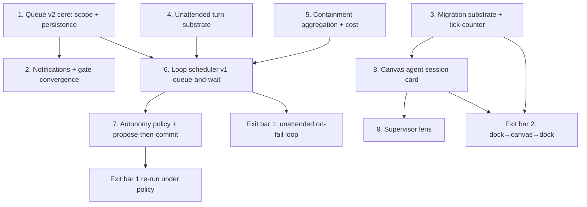

# Workstation Phase 3 — Implementation Specs (canonical order)

Distilled from a 4-designer (dependency-graph / risk / tracer-bullet / product lenses) +
2-judge workflow (2026-07-14; **both judges independently selected the risk design**,
with grafts from all three runners-up folded in below), grounded in six disk-verified
investigation dossiers (loop seams; approvals + notifications; session cards +
migration; supervisor lens; propose-then-commit; residuals + constraints). Each step is
one grabbable unit of work ending in a green `npm run check` and a main commit (repo
convention: no feature branches; full pre-commit gate). Contracts:
`01-interface-contracts.md` v1.2.8 at spec time; **v1.3.0 lands at step 1** (the queue
scope contract is the structural change), then v1.3.x patch entries per landing step in
§8. Every file:line below was disk-verified at `83d6e3d` — **re-verify with `rg`
against disk before editing**; steps land sequentially and move each other's code. Also
re-check `git ls-files -v | grep '^S'` (skip-worktree) at each step start — empty at
spec time, historically not.

**Phase 3 scope (PLAN.md, binding — do not re-litigate):** loop scheduler (trigger ×
prompt × agent, per-loop autonomy policy, queue-by-default; the trigger enumeration
on-save / interval / on-fail / manual is PLAN's five-primitives §Loop definition);
global approval queue with notifications; canvas session cards + one-click dock↔canvas
migration; zoom-out supervisor lens via existing LOD; propose-then-commit for
irreversible ops. **Exit bar:** an on-fail loop fixes a broken test unattended with
every write queued; a live session migrates dock→canvas→dock without losing scrollback.

**Inherited Phase-3 residuals (also binding):** per-slug budget aggregation
(04-phase-2-specs.md "Deferred / accepted residuals") and the max-$ cost budget — whose
recorded deferral rationale ("no cost observable exists in the `--print` model") is
**stale**: claude 2.1.205 stream-json emits `total_cost_usd` (+ per-model `costUSD`) on
the result record, live-verified 2026-07-14. Max-$ is in scope claude-only, with honest
per-adapter degradation; codex claims coverage only after a real `codex exec --json`
spike; gemini/raw report "cost unobservable", flagged, never faked.

**Design lens (recorded so the ordering is not re-litigated):** the riskiest /
least-reversible work retires earliest behind evidence gates. The one safety-semantics
change (queue scope) lands first, alone, atomically with its evidence; the one
inherited-unverified exit-bar acceptance (tick-counter migration) closes before
anything builds on it; containment lands one commit before any trigger exists; the
scheduler ships queue-and-wait only, with every autonomy escalation separately gated.

## Stale-claim ledger (each has an owner; none is silently corrected)

| Stale claim | Reality (disk-verified 2026-07-14) | Owner |
| --- | --- | --- |
| "no cost observable in the `--print` model" (04-phase-2-specs.md, max-$ residual) | claude 2.1.205 emits `total_cost_usd` on the result record; the parser drops it (`agent-adapters.ts` result branch) | Step 5's commit corrects the 04 line |
| HANDOFF "Known follow-ups": FilesDockAdapter vault switching bypasses `workspace.open()` | FIXED on disk — `handleOpenVaultPicker`/`handleSelectVault` dispatch `te:open-vault` → `workspace.open()`, with the step-1 finding named in the comment (`dock-adapters/FilesDockAdapter.tsx:306-325`) | Cleared in the spec-pass HANDOFF update |
| `thread-store.ts` "~825-830 lines" (all prior specs) | 1009 lines (`wc -l`); "route around it" failed twice (Phase 2 steps 3 and 8 both grew it) | Step 3's dock-store extraction brings it under 800; zero growth allowed anywhere else |
| Dossier 06 path `src/renderer/src/store/terminal-migration.ts`; dossier 06 "session card will be a new CanvasNodeType" | File lives at `src/renderer/src/panels/agent-shell/terminal-migration.ts`; the session card generalizes the existing `terminal` card in place (dossier 03, adopted by all four designs — recorded divergence, see step 8) | This spec carries the corrections |

Cross-step rules:

- `TE_DIR` constant everywhere (dev `.machina-dev`, prod `.machina`); a hardcoded
  `.machina` is a bug except inside `HARNESS_PROTECTED_GLOBS`.
- Files under 800 lines. `thread-store.ts` (1009) shrinks under 800 at step 3 and
  **never grows in any step** — all loop/session state goes in new small stores (the
  `cli-session-store.ts` discipline). `canvas-store.ts` is at 786 — steps 8-9 put
  session-card logic in new modules.
- `ipc-channels.ts` / `preload/index.ts` / `main/index.ts` additions append-only at
  file end (parallel-session rule). No Phase-3 channels are reserved in contracts §6
  today — each step mints its own, appended.
- Any deliberate contracts deviation amends `01-interface-contracts.md` in the same
  commit. Doc reconciliation is part of each step, not phase close (`CLAUDE.md` fuller
  reference; `AGENTS.md` intentionally Codex-curated; `npm run sync:agents` is a no-op
  guard).
- Safety invariants (PLAN, binding on every step): parity direction only; verify.sh
  stays agent-inaccessible; **queue-all-writes is the immutable default** (autonomy
  policy is disposition of already-queued writes plus dispatch arming, never prevention
  of writes); **UI copy never claims writes are blocked** — the canonical rule is the
  `ApprovalsTray.tsx:4-7` file header ("Never phrase the queue as write-blocking"),
  which now extends to OS notification copy; no window where rollback coverage gaps.
- `AgentAdapter.permissionHooks` (the reserved OQ1 seam) remains untouched by every
  step below; autonomy policy is queue-routing configuration, not a revival of OQ1
  (OQ-C records the Phase-3 disposition).
- js-yaml moderate advisory via gray-matter (GHSA-h67p-54hq-rp68, fix available):
  step 6 raises frontmatter-parse exposure — take the scoped fix in step 6's commit or
  record why not; the structural mitigation (no-tick-path parse) is specced in step 6
  regardless.
- Dev-app smoke checks are Claude-driven; Electron visual verification is Casey
  observing the running app — no programmatic Electron screenshots. Each
  Casey-observed gate below is phrased as the lived-usage script he runs that day.

## Step 1 — Global approval queue v2 core: multi-root scope + persistence + gate-confirm root-binding

> **DONE** (2026-07-14, contracts v1.3.0). Landed as specced: clear-on-switch
> removed with same-root restart semantics preserved; cli-change items persist to a
> versioned userData mirror (`approval-queue-persistence.ts`, HarnessRunRegistry
> pattern) and rehydrate once per app run with per-item fresh-diff re-validation
> against the item's OWN capturedRoot (drift/missing-root/diff-failure ⇒ drop +
> `approvals:rehydrate-drop` audit); gate-confirms record capturedRoot, refuse
> cross-root resolution, and are never serialized (enforced in the queue snapshot
> AND re-filtered at decode, both pinned); tray shows root labels + the OQ-A (a)
> switch-to-resolve affordance with Approve/Reject withheld on foreign items; no
> new IPC minted (the existing workspace-open path sufficed). **Recorded
> deviations:** the orphaned `ApprovalQueue.clear()` method was deleted entirely
> (zero production callers after the call removal; its copy contradicted the
> multi-root contract); a pending gate-confirm now survives a workspace switch for
> up to its 30s timeout (previously denied instantly by clear — cross-root refusal
> + remove-on-timeout bound its life, tested); the contracts v1.2.1
> "restart-preserves-queue" bullet still claimed clear-on-init was load-bearing
> and was reconciled in the same commit. **Post-implementation review** (4 lenses:
> spec compliance, adversarial persistence semantics, test quality, Codex cold
> read) surfaced 13 findings; all 6 blocker/major CONFIRMED and fixed in the same
> tree: wrong-root capture race (`recordWrites` now binds to the caller-supplied
> capturing root, mirroring autoReject's expectedRoot); cross-run `pc_<turnId>`
> collision (turn ids now run-unique `t<seq>-<runTag>`, plus coalesce-refusal on
> capturedRoot mismatch as defense in depth); silent decode-level mirror drops
> (load returns drop diagnostics, audited at `mirror-decode`); autoReject root
> re-read race (binds to entry root); `[diff unavailable` marker treated as
> comparable (now `diff-failed` ⇒ drop + audit; marker constant shared in
> git-types so builder/detector cannot drift). **Recorded residual minors** (not
> fixed this step, none safety-invariant): no barrier against a pre-rehydrate
> queue mutation truncating the un-read mirror (safe under current wiring; step 6
> arms the trigger — re-check there); mirror persist failures are swallowed
> (restart durability degrades silently; candidate for step 2's notification
> classes); no mirror flush on quit (a write captured in the last instant before
> exit can miss the mirror; the write itself is on disk — convenience loss only);
> transient stale-activeRoot window in the tray after a switch until refresh.
> **Evidence (fresh runs on the final tree):** `npm run check` 314 files / 3810
> tests green (+42 over the step-8 baseline); build green; full e2e 26 passed / 1
> known skip INCLUDING the new `e2e/approvals-persistence.spec.ts` restart probe
> (real claude turn → `pc_<turnId>` item → quit → relaunch → rehydrated +
> resolvable → trailered commit); `npm audit --omit=dev` = the 1 known moderate
> js-yaml advisory. **Casey-observed acceptance still pending:** switch workspaces
> mid-review and watch queued items survive with root labels; a foreign-root item
> offers the switch affordance instead of resolution.

**Goal.** Make the queue genuinely global — items survive workspace switches and app
restarts — **without weakening the workspace-root resolution invariant.** This is the
one step that touches a load-bearing safety behavior (`initApprovalsForRoot` →
`getApprovalQueue().clear()`, `ipc/git.ts:349,356`), which is exactly why it goes
first, alone, behind its own gates. Split from the notification/convergence work
(step 2) so the invariant-weakening edit lands atomically with its evidence and
nothing else (judge graft).

**Design decisions (recorded):**

- ONE queue, genuinely multi-root: remove the `clear()` from `initApprovalsForRoot`;
  items are keyed and displayed with their `capturedRoot` (`approval-queue.ts:105`).
  "Global" = **visibility across roots, never cross-root resolution**.
- Resolution stays bound per item: `resolve()`'s workspace check
  (`approval-queue.ts:269`) is **kept**; the tray gains a "switch to workspace X to
  resolve" affordance for foreign-root items (OQ-A option (a) — the safe default;
  transparent-switch can layer on later without rework).
- Persistence: serialize `PendingChange` items (plain/JSON-safe, `git-types.ts:56`) to
  `userData` (audit-logger placement precedent), following the `HarnessRunRegistry`
  file pattern byte-for-byte (versioned shape, atomic serialized persist chain,
  degrade-not-fail load). On launch, rehydrate and re-validate every item against a
  fresh diff via the existing stale-diff machinery (`approval-queue.ts:281-293`); items
  whose disk state changed while the app was closed are dropped with an audit entry,
  never silently resolved. **Gate-confirm items are NEVER persisted** (they hold live
  Promise waiters; a rehydrated confirm is an unanswerable zombie row and resurrects
  the stale-click hazard the 30s remove-on-timeout exists to kill,
  `queue-hitl-gate.ts:7-9`). This exclusion is mandatory in this commit, not a later
  refinement.
- Gate-confirm root-binding: `enqueueGateConfirm` (`approval-queue.ts:360-391`) gains
  the same captured-root discipline as cli-change items (today it records none) —
  prerequisite for step 2's convergence.

**Files/services touched:** `approval-queue.ts` (persistence deps, root capture), new
`approval-queue-persistence.ts` (small, HarnessRunRegistry-pattern),
`ipc/git.ts:349-364` (clear removal, rehydrate on init), `git-types.ts` (payload
additions), `ApprovalsTray.tsx` + `approvals-store.ts` (root labels, foreign-root
affordance — the `workspace-changed` copy at `approvals-store.ts:19` reuses),
`ipc-channels.ts`/preload appends (`approvals:reveal-root` if the existing
workspace-open path doesn't suffice).

**Contracts delta (v1.3.0, the structural bump):** §4 — queue scope contract
rewritten: multi-root visibility + per-item root-bound resolution (invariant restated
verbatim); persistence + rehydrate-revalidate rule; gate-confirm-never-persisted rule;
gate-confirm root-binding. §6 — new invoke if minted. §8 changelog entry.

**Tests.** Unit: persistence round-trip + corrupt-file degrade-not-fail; rehydrated
item with drifted disk state dropped via stale-diff + audited; cross-root resolve
still refuses `workspace-changed`; workspace switch no longer clears items (and
same-root restart behavior preserved); gate-confirm carries root, refuses cross-root,
and is never serialized. E2e (built app): queue an agent write, quit, relaunch → item
present and resolvable; approve → commit carries `Machina-Agent`/`Machina-Session`
trailers (rollback-coverage evidence).

**DONE bar.** Green check + build + the restart e2e. **Safety-invariant gate
(explicit):** the `capturedRoots` refusal test and the restart-rollback e2e are green
in the same commit that removes the clear — the invariant-weakening change and its
evidence land atomically. **Casey-observed (what you get that day):** switch
workspaces mid-review and watch your queued items survive with their root labels; try
to resolve a foreign-root item and get the switch affordance instead of a wrong-tree
resolution.

**Risks.** Removing the clear is the least-reversible change in Phase 3 (semantics,
not code) — hence first + gated. Rehydrate-revalidate is conservative by design: when
in doubt, drop + audit (writes remain on disk; post-persistence containment means
dropping an item loses convenience, never data).

## Step 2 — Notifications + propose-surface convergence: OS notifier, attention policy, MCP + native gate-confirms

**Goal.** The "with notifications" half of PLAN's queue line, plus convergence of both
non-CLI approval surfaces onto the queue so there is one review surface: MCP confirms
(QueueHitlGate swap) and native-agent tool holds (the mirror — without it the step-7
two-tier contract would claim coverage no step delivers; judge-confirmed gap).

**Work:**

- Notifications, main-side at the single choke point: enrich `notify`
  (`ApprovalQueueDeps.notify`, `approval-queue.ts:58`; fan-out
  `broadcastApprovalsChanged`, `git.ts:50`) with an item delta (added ids +
  agent/root labels) so notifications fire once per genuinely-new item, never on
  resolves. Electron `Notification` + `app.dock?.setBadge` in main (bundle identity
  already set: `com.machina.app` + `setAppUserModelId`); click-to-focus via
  `getMainWindow()`.
- **Attention policy (recorded, product-lens graft):** interactive-session queue items
  notify only while the window is unfocused; **loop-context items, breaker trips,
  watcher-health `down` transitions, and maxSpendUsd/disarm events ALWAYS notify**;
  the dock badge always reflects the pending count. The loop-context signal arrives
  with step 6; the policy table lands now so the wiring is shaped for it.
- Also notify on `agent:breaker-tripped` (`ipc/cli-thread.ts:288-291`) and on
  watcher-health `down` (`markApprovalsWatcherDown`/`noteWatcherRecovered`) — "gate
  went down" is exactly when the tray dot goes unseen.
- MCP convergence: swap `new TimeoutHitlGate(new ElectronHitlGate())` at
  `mcp-lifecycle.ts:109` for `new QueueHitlGate(getApprovalQueue())`
  (`queue-hitl-gate.ts:21-30`, built and unit-tested since Phase 1 step 3;
  `QueueHitlGate` owns its timeout internally so the wrapper drops on that path). The
  30s auto-deny posture is OQ-B: keep, fail-closed.
- Native mirror: surface the native agent's `tool_pending_approval` holds
  (`machina-native-tools/context.ts:15-38`, emitted at `machina-native-agent.ts:219`)
  as queue gate-confirm items so unattended/unfocused native ops reach the same tray +
  notification path. Single resolution authority: resolving from either surface
  resolves the hold exactly once (double-resolve test). Re-verify the hold lifecycle
  against disk at implementation; if a true single-authority mirror is not cleanly
  achievable this step, amend the step-7 Tier-E table to exclude native instead —
  never claim unconverged coverage.
- **Copy gate:** every notification string obeys the `ApprovalsTray.tsx:4-7` header
  rule (writes are already on disk; "queued for review", never "blocked").

**Files/services touched:** `approval-queue.ts` (delta notify), `ipc/git.ts:50-53`
(notification tap), new `services/approvals-notifier.ts` (small),
`mcp-lifecycle.ts:109` (swap), `machina-native-agent.ts` / `machina-native-tools/`
(mirror seam), `ApprovalsTray.tsx` (gate-confirm rows for the converged surfaces).

**Contracts delta (v1.3.1):** §4 — notification honesty rule (tray header rule
extended to OS surfaces) + the attention-policy table; converged-surface rule (MCP +
native resolve through the queue; single resolution authority). §6 —
`approvals:changed` payload gains the item delta (amendment recorded). §8 entry.

**Tests.** Unit: delta-notify fires only on adds; attention-policy table (focused
suppress for interactive; always-notify classes); MCP gate swap delegation (extend
`queue-hitl-gate.test.ts`); native mirror double-resolve; copy lint (no
"blocked"/"prevented" in notification strings). E2e: an MCP write confirm appears as a
tray gate-confirm item (not a modal) and auto-denies at 30s.

**DONE bar.** Green check + e2e. **Casey-observed (that day):** with the app
unfocused, an agent write fires an OS notification + dock badge; clicking it lands in
the tray; an MCP write confirm shows up as a tray row and fails closed at 30s if
ignored.

**Risks.** The modal→tray UX shift for MCP/native is a behavior change reviewers must
see (hence its own step and Casey gate, split from step 1). Notification fatigue —
the attention policy is the mitigation; tune classes, never silence safety events.

## Step 3 — Migration substrate hardening: tick-counter acceptance, dock-tab retirement, thread-store under 800

**Goal.** Retire the inherited hazards under exit bar 2 **before** agent-card work
builds on them: (a) the Phase-1 step-4 tick-counter continuity acceptance — still OPEN
and verbatim Phase 3's exit bar — is inherited unverified; (b) the wired-but-never-
opened `kind:'terminal'` DockTab (`dock-types.ts:4`, `DockTabContent.tsx:53`) leaks
its PTY on close and is a trap for the step-8 "dock home" decision; (c)
`thread-store.ts` is 26% over the file cap and every prior "route around it" failed.

**Work:**

1. Retire the `kind:'terminal'` DockTab: delete the variant + render case. Recorded
   decision: the dock home for plain terminals is the strip; for agent sessions it is
   ThreadPanel's agent surface (`ThreadPanel.tsx:327`) — documented in contracts §3.
2. **Extract `dock-store.ts`** (judge graft; the deletion alone cannot close a
   209-line overage): move the dock-tab/layout slice out of `thread-store.ts` into a
   new store, riding the same commit surface that already edits `removeDockTab`.
   Under-800 is this step's hard gate, verified by `wc -l` in the DONE bar.
3. Single-projection invariant test: at most one mounted webview per `sessionId`;
   migration is atomic (source detaches before destination mounts — the
   `terminal-migration.ts:32-70` pattern; `session-router.register` is
   last-writer-wins, so a second projection means silent input contention). No router
   multicast in Phase 3.
4. Run the tick-counter acceptance: `while true; do echo tick $((i++)); sleep 0.2;
   done` → strip→canvas→strip → ticks consecutive, same PTY (`Ctrl+C; echo ok`),
   within the ring-buffer window (`pty-service.ts:41-42,99-109,135-173` is the premise
   being validated).

**Files/services touched:** `dock-types.ts`, `DockTabContent.tsx:53`,
`thread-store.ts` (deletion + slice extraction — net under 800), new
`store/dock-store.ts`, `panels/agent-shell/terminal-migration.ts` (test surface),
`terminal-strip-store.ts:149-170` (unchanged; tests assert detach-no-kill retained).

**Contracts delta (v1.3.2):** §3 — dock-surface decision recorded (strip = plain,
ThreadPanel = agent; `kind:'terminal'` DockTab retired); single-projection invariant
stated. §8 entry. No new IPC.

**Tests.** Unit: dock-tab variant gone (type-level + render dispatch); detach-no-kill
retained; dock-store extraction behavior-preserving (existing thread-store dock tests
migrate, not weaken); "no two concurrent live projections of one sessionId".

**DONE bar.** Green check; `wc -l` on `thread-store.ts` < 800 recorded in the commit;
**Casey-observed (that day):** the tick-counter run, strip→canvas→strip, consecutive
ticks + live PTY confirmed — this closes the OPEN Phase-1 step-4 acceptance and banks
the plain-terminal half of exit bar 2 fresh, not inherited.

**Risks.** Low — deletion, extraction, tests, one manual acceptance. If the
tick-counter run FAILS, Phase 3 just caught its exit-bar regression at step 3 instead
of step 8; the fix lands here before anything builds on the premise.

## Step 4 — Unattended turn substrate: exported main dispatch + main-side transcript persistence

**Goal.** Retire the load-bearing gap for exit bar 1: today no function in main can
run "prompt → bound thread" (`getSpawner()` is module-private, `ipc/cli-thread.ts:38`)
and assistant replies only reach disk via the renderer subscriber
(`use-thread-streaming.ts:95-131` → `thread:save`) — an unattended turn would produce
writes, queue items, and audit entries but **no transcript**. This step makes a full
turn main-originable and main-persisted before any scheduler exists to call it.

**Work:**

- Export `dispatchAgentTurn(...)` from `ipc/cli-thread.ts`, containing exactly the
  current `cli-thread:input` handler body (`:332-373`: `resolveRequestedAgentId` →
  `resolveRequestedModel` → `getSpawner().input(...)`); the IPC handler becomes a thin
  caller. The spawner singleton stays module-private (one instance owns
  `closedThreads`/`sessionByThread` invariants). Turn windows, budgets, breaker, and
  the approvals gate engage automatically because they hang off `turnStarted`
  (`cli-thread-spawner.ts:329-336`) — the attribution/model trust boundary is never
  bypassable by construction.
- Main-side shell-readiness wait: replicate the renderer block-store poll
  (`store/harness-run.ts:34-44`) on `BlockWatcher`'s block transitions
  (`ipc/shell.ts:49-61`) — wait for the fresh session's first block before sending,
  preserving the Phase-1 step-6 lost-reply lesson recorded at
  `store/harness-run.ts:1-9`.
- Main-side transcript persistence: persist the bridge's final assistant message
  (`cli-agent-thread-bridge.ts:211,243` onTurnComplete wiring) to `ThreadStorage` in
  main; renderer treats `thread:cli-message` as display-only; a `thread:changed` push
  event lets an open renderer refresh. This is a §4-adjacent cutover — specced, not
  improvised: **exactly-once persistence must move, not duplicate** (double-append is
  the failure mode; the cutover test below is the gate).

**Files/services touched:** `ipc/cli-thread.ts` (factor + export), `ipc/shell.ts`
(readiness tap, persistence wiring), `cli-agent-thread-bridge.ts` (final message
surface), `services/thread-storage.ts` (append entry point),
`use-thread-streaming.ts:95-131` (persistence removed, display kept),
`thread-store.ts` — **zero growth**: the `thread:changed` subscription goes in a new
tiny store/hook if it cannot ride an existing subscriber. `ipc-channels.ts`/preload
appends.

**Contracts delta (v1.3.3):** §4 — transcript persistence authority moves main-side
(recorded cutover + exactly-once rule); §6 — new event `thread:changed` (and
`thread:created` if minted); §8 entry.

**Tests.** Unit: `dispatchAgentTurn` parity with the IPC handler (same validation
chain); exactly-once persistence (no double-append when a renderer IS subscribed — the
regression the cutover invites); main-side readiness wait (no send before first
block). E2e (built app): a turn dispatched via a dev-only test channel with the window
blurred → thread file on disk contains the assistant reply AND the write landed as a
`pc_<turnId>` queue item; a normal renderer-sent turn still streams and persists
identically (the Phase-1 step-6 lesson's regression guard).

**DONE bar.** Green check + build + both e2e probes. No visual gate; the evidence is
transcript-on-disk + queue-item-present with no renderer participation.

**Risks.** The persistence cutover is the delicate edit (lost-reply history lives
exactly here) — hence the double-guard probes. `ipc/cli-thread.ts` is also step 5's
surface: steps 4 and 5 are strictly sequential.

## Step 5 — Containment aggregation + durable budgets + cost observable (BEFORE any trigger exists)

**Goal.** Land the containment floor the scheduler requires, one commit before the
scheduler: per-slug aggregation (without it, a loop minting a fresh thread per firing
gives every firing the FULL per-thread allowance — N firings ≈ N× budget), a durable
cross-firing budget shape (in-memory `invocationCounts` reset on relaunch and breaker
episodes reset on every `turnStarted` — a scheduler that re-fires after kill/relaunch
silently refills budgets), and the max-$ observable (claude cost is live but dropped
by the parser, `agent-adapters.ts:494-514`, result branch `:510-511`).

**Work:**

- Per-(root, slug) turn rollup beside `invocationCounts` in `CliTurnRegistry`
  (`cli-turn-registry.ts:161-196`), enforced alongside `checkMaxTurnsOnTurnStarted`
  (`ipc/cli-thread.ts:242-257`); per-slug limiter option beside `limiterFor`
  (`agent-write-watcher.ts:471-477`). Per-thread semantics stay for attended threads;
  **the aggregate is a second ceiling, not a replacement — parity direction only.**
- `AgentStreamEvent` gains `costUsd: number | null`; `parseClaudeEvent` reads
  `total_cost_usd` from the result record; the bridge accumulates per thread and feeds
  a `noteCost` breaker input (notice-class) plus a rollup the LoopRegistry will read.
  **Codex `--json` usage records: spike in this step** — claim codex coverage only on
  verified output; gemini/raw report "cost unobservable" honestly (the budgets-absent
  "no enforcement, flagged" pattern). Correct the stale 04-phase-2-specs.md max-$ line
  in this commit (stale-claim ledger).
- Max-$ enforcement posture (recorded): **loop-level disarm at `maxSpendUsd`**
  (durable, in the step-6 LoopRegistry) + per-thread `noteCost` as **notice-class** in
  Phase 3 — never kill-class until calibrated (a mispriced kill on a healthy turn is
  the false-positive failure mode; disarm-between-firings is losslessly safe).
- Breaker calibration under loop-shaped traffic: `VELOCITY_TRIP_CONSECUTIVE = 3` and
  the headMoved notice taxonomy were tuned against human-paced turns. Add a synthetic
  loop-traffic unit suite (rapid same-slug re-fires) documenting observed trip
  behavior — evidence for step 6's thresholds, not a silent inheritance.

**Files/services touched:** `cli-turn-registry.ts`, `ipc/cli-thread.ts:242-287`,
`agent-write-watcher.ts:471-477`, `agent-adapters.ts` (`parseClaudeEvent`, and
`parseCodexEvent` only if the spike verifies), `session-types.ts` (one field),
`cli-agent-thread-bridge.ts` (accumulate), `agent-circuit-breaker.ts` (`noteCost`
notice input), `harness-types.ts` (budget shape additions if any),
`04-phase-2-specs.md` stale-line correction.

**Contracts delta (v1.3.4):** §5 — aggregation semantics (per-thread AND per-slug
ceilings, parity direction); cost observability matrix per adapter (claude verified /
codex per spike / gemini+raw unobservable-flagged); maxTurns stays coarse by design
(OQ2 restated — do not parse adapter streams to count internal turns); loop iteration
≠ thread maxTurns: a loop firing is one `turnStarted` on a fresh thread, capped by the
loop's own durable counters. §8 entry. No new IPC.

**Tests.** Unit: N same-slug threads share the aggregate allowance while each keeps
per-thread semantics; kill does not refill; cost parse fixture from a real claude
result record; null-cost adapters flagged not zeroed; loop-traffic breaker suite. No
e2e (main-side accounting; step 6's exit-bar run exercises it end-to-end).

**DONE bar.** Green check; the loop-traffic calibration results recorded in this
step's DONE block (numbers, not vibes).

**Risks.** Touches the two hottest containment files — sequential after step 4 (shared
`ipc/cli-thread.ts`) and strictly before step 6. Aggregation must not change
attended-thread behavior: the golden per-thread tests are the regression fence.

## Step 6 — Loop scheduler v1: definitions, LoopRegistry, trigger bus, queue-and-wait only — exit-bar-1 run

**Goal.** The scheduler itself, shipping with exactly one autonomy policy:
`queue-and-wait` (queue-by-default made literal). Every guard it needs already exists
(steps 1/2, 4, 5). Exit bar 1 is this step's DONE bar.

**Work:**

- **Definitions:** `<TE_DIR>/loops/<slug>.md` — frontmatter (trigger kind + params,
  harness slug, prompt/taskBrief, loop budgets: `maxFirings`,
  `maxConsecutiveFailures`, `maxSpendUsd`, autonomy policy) in the hand-rolled parser
  style (`harness-types.ts:428-493`), lint-composed and greyed-not-hidden like
  harnesses. The loop prompt is the harness run's taskBrief (4000-char gate);
  composition rides `composeHarnessRun` (`harness-run.ts:50-128`) — **a loop firing IS
  a harness run.**
- **Tamper containment:** snapshot definition → LoopRegistry state at arm time (loop
  files are agent-writable, same channel as SKILL.md budgets); post-arm edits affect
  the next arm only. **No-tick-path parse rule (judge graft):** definitions parse once
  at arm via the hand-rolled parser and run from the userData snapshot; the scheduler
  never parses agent-writable frontmatter on a trigger tick (also the structural
  js-yaml mitigation). Widen `HARNESS_PROTECTED_GLOBS` to `**/<TE_DIR>/loops/**` per
  OQ-D's recommendation (new files, breaks no existing flow — the SKILL.md-widening
  rejection does not carry over).
- **LoopRegistry:** `userData/loop-state.json`, copying the HarnessRunRegistry pattern
  byte-for-byte in structure: last-fire, firing count, consecutive-failure count,
  accumulated spend, disarm latch + reason. Durable across relaunch.
- **Trigger bus** (one main-side `LoopScheduler` service): **manual** (palette →
  `loop:fire`); **interval** (one timer wheel, generation-fenced per workspace — the
  `watcherGeneration` pattern); **on-save** — the vault-watcher main-side batch seam
  is **single-slot and occupied** (`setVaultBatchListener`, `ipc/watcher.ts:17-19`,
  invoked by the MCP vault index at `:46`): widen it to a multi-subscriber fanout (or
  add the scheduler call inline in the `vault:watch-start` callback) — **displacing
  the MCP index silently kills main-process search/graph/ghost freshness** (judge
  graft; never the agent-write-watcher, whose ignore policy is gate-owned by
  contract); **on-fail** — the scheduler runs the loop's verifier itself via a small
  executor: verify.sh executes inside the agent's `claude --print` block and never
  surfaces as a block/exit code, so agent-internal runs are not an observable;
  block-exit≠0 is only a secondary user-terminal source. **Verifier default (judge
  graft):** the bound harness's verify.sh executed BY THE APP (the 0555 copy, lint
  mode-drift checked, agent-inaccessibility unchanged), with an optional frontmatter
  override command snapshotted at arm.
- **Firing gate (explicit, all conditions AND):** no open turn for the root
  (`activeTurnFor`) AND linger + awaitWriteFinish drained (`LINGER_MS = 1500`) — the
  anti-self-trigger rule for on-save — AND `getWatcherHealth().state === 'watching'`
  (**stricter than OQ6's never-block rule, deliberately**: OQ6 governs turns a human
  sends; an unattended firing into a down gate is uncontained by design — recorded so
  it reads as policy, not a contradiction) AND current workspace root matches the
  loop's root (OQ8 interim fence) AND all durable budgets have headroom.
- **Disarm rules:** hard-disarm on breaker kill, on maxConsecutiveFailures, on
  maxFirings, on maxSpendUsd (claude-costed loops), on watcher-down-while-armed →
  pause. Re-arm is a human act, audited. A kill is never interpreted as "retry".
- **Firing = main-side end-to-end:** mint thread (service path) → `composeHarnessRun`
  → readiness wait → `dispatchAgentTurn` (step 4) → at turn end + quiescence, item
  sits in the queue (`queue-and-wait`), OS notification fires (step 2's loop-context
  always-notify class, now live). Every fire/skip/disarm decision gets an audit entry.
- **UI:** minimal arm/disarm/fire surface (palette entries + a loops section reusing
  the gallery pattern); the tray shows loop-originated items exactly like manual ones
  (they ARE the same item kind).

**Files/services touched:** new `services/loop-scheduler.ts`, new
`services/loop-registry.ts`, new `services/loop-types.ts` (parser), new
`services/verifier-executor.ts` — all new small files; taps in `ipc/watcher.ts:25-47`
(fanout widening), `ipc/git.ts` (health read), `constants.ts:31-34` (glob widening),
new `ipc/loop.ts`; renderer: new `store/loop-store.ts` (zero thread-store growth),
palette source addition. `ipc-channels.ts`/preload/main appends.

**Contracts delta (v1.3.5):** new § — loop definition format, LoopRegistry shape,
trigger semantics (incl. the single-slot fanout widening), firing-gate conditions
verbatim, disarm taxonomy, the no-tick-path parse rule, queue-and-wait as the only v1
policy, the OQ6-vs-loop-pause distinction. §6 mints `loop:list`, `loop:arm`,
`loop:disarm`, `loop:fire` (invokes), `loop:state-changed` (event) — append-only. §8
entry.

**Tests.** Unit: parser + lint (bad frontmatter greys, never hides); snapshot-at-arm
tamper test (post-arm file edit does not change the armed config); every firing-gate
condition individually (open-turn suppress, linger wait, degraded pause, budget
exhaustion, root fence); disarm-on-kill; durable counters survive a simulated relaunch
(registry reload); verifier executor exit-code + timeout discipline; MCP vault index
still receives batches after the fanout widening. E2e (built app): scripted on-fail
loop against a repo with a broken test — fires, dispatches, writes queue, verifier
re-run passes, loop goes idle; an on-save loop whose agent writes must NOT re-fire it
(the self-trigger negative).

**DONE bar = exit bar 1.** Green check + e2e; then the live acceptance: a real on-fail
loop fixes a real broken test **unattended** (Casey arms it, leaves the app
unfocused/away; Claude drives setup only) with every write in the queue, the OS
notification received, the transcript on disk, and the audit trail showing
fire→turn→queue→notify. **Casey-observed (that day):** arm a loop from the palette,
walk away, come back to a notification, review the queued diff in the tray, approve
it, see the trailered commit.

**Risks.** Largest step; deliberately late so every hazard class already has its guard
landed and tested. The remaining novel risk is trigger-gate logic itself — covered by
the per-condition unit suite. Self-trigger is the scenario to distrust most: the e2e
includes the on-save negative.

## Step 7 — Autonomy policy escalations + propose-then-commit (two-tier contract)

**Goal.** The per-loop autonomy policies beyond queue-and-wait, and PLAN's
"propose-then-commit for irreversible ops" — defined honestly as a two-tier contract:
**Tier E (enforce)** = operations the app mediates (native/MCP — converged in step 2 —
and loop dispatch), held pre-execution via gate-confirm; **Tier D (detect + surface)**
= everything a dispatched CLI turn does. UI verbs are partitioned by tier; Tier-D
features never use Tier-E verbs ("blocked", "prevented").

**Work:**

- **Policy enum per loop:** `queue-and-wait` (default, immutable floor) |
  `queue-and-notify` | `auto-accept-in-scope` | `propose`. Nothing ever skips
  `recordWrites`, autoReject, or the audit trail — policy is disposition of
  already-persisted writes plus dispatch arming, never prevention.
- **auto-accept-in-scope:** evaluated main-side at turn quiescence (turnEnded + linger
  + awaitWriteFinish); auto-approves ONLY an item whose flags are ALL false (flags
  OR-merge and never untrip) and whose every path matches the loop's auto-accept
  globs; executes as `ApprovalQueue.resolve(id, true)` — inheriting trailers, audit,
  TOCTOU stale-diff guard, and revertability. On `stale-diff`: re-wait, never force.
  Anything flagged falls back to queue-and-notify. `HARNESS_PROTECTED_GLOBS`
  autoReject stays above policy.
- **propose:** the loop composes its invocation, then `enqueueGateConfirm` a
  `loop:dispatch` item (trigger + prompt + declared ops + exact invocation preview)
  and dispatches only on allow — enforcement point is before the `PtyWriteQueue`
  `'agent-input'` write, the pre-declared policy-gating seam. **Loop-dispatch confirms
  do not auto-deny:** a parked loop is safe; a silent 30s deny is a policy decision
  nobody made. Parking must not regress the stale-click property — a parked confirm is
  cancelled (removed + audited) on workspace switch, loop disarm, or app quit, exactly
  never answerable late, **and allow re-validates at dispatch time (root matches,
  loop still armed, budgets still have headroom) before sending** (judge graft). The
  30s remove-on-timeout stays for all non-loop gate-confirms (OQ-B).
- **Tier-D detector:** one small pure module consuming the existing main-side taps —
  `ToolCall {name, inputPreview}` from the bridge (`cli-agent-thread-bridge.ts:183`)
  and `Block.command` — pattern-matching a closed vocabulary (`git-push`,
  `remote-api`, `package-publish`, `force-ops`, `out-of-root-delete`). Output: new
  `PendingChangeFlags.irreversibleOpObserved` (OR-merged), an audit entry naming the
  pattern, and a breaker **corroboration rule**: headMoved + git-class tool_use in the
  same turn ⇒ kill-class (the recorded cheap-reversal path for the notice-latch's
  weakened ambiguity argument under unattended loops) — bare headMoved stays
  notice-only. Labeled best-effort everywhere (200-char truncation, claude/codex-only,
  execution-time): the observability matrix goes into contracts verbatim so nobody
  later mistakes detection for prevention. Untracked-delete queue copy says "not
  recoverable by discard".
- **Declared irreversible intent:** extend scope.json with the closed vocabulary; the
  linter validates; an undeclared-op mention in a loop's prompt ⇒ that loop's
  effective policy for the firing escalates to `propose`. Cooperative at prompt level,
  tamper-contained at the contract-file level (autoReject + 0555 + lint mode-drift).
- **Confirm UI primitive:** extract `RevertAgentSection`'s inline arm→confirm into a
  small shared component (the codebase's only propose-then-commit precedent; no
  modal-confirm component exists) and use it for loop-policy escalation confirms.
- **Copy lint:** a unit-level string audit that Tier-D surfaces (flags, notifications,
  tray chips) contain no "blocked/prevented"; propose copy reads "approve sending this
  turn", never "approve this push".

**Files/services touched:** `loop-scheduler.ts` (policy evaluation),
`approval-queue.ts` (parking variant, new flag), new
`services/irreversible-op-detector.ts`, `agent-circuit-breaker.ts` (corroboration
input), `git-types.ts` (flag), `harness-types.ts` + linter (scope vocabulary),
`ApprovalsTray.tsx` + `approval-flags.ts` (flag chip, confirm primitive), new shared
confirm component.

**Contracts delta (v1.3.6):** §4/§5 — the two-tier contract + observability matrix +
verb partition rule; policy enum semantics (disposition, never prevention);
parking-confirm lifecycle incl. dispatch-time re-validation; corroboration rule
recorded as a deliberate breaker taxonomy amendment; flag-taxonomy table gains
`irreversibleOpObserved`. §8 entry. No new IPC (policy rides loop defs + existing
`approvals:resolve`).

**Tests.** Unit: flag-fence (each flag individually defeats auto-accept); quiescence
timing; stale-diff re-wait; parking confirm never auto-denies, is cancelled on
switch/disarm/quit, and re-validates on allow; detector pattern table (hits +
deliberate misses documented); corroboration kill fires only on the pair; copy lint.
E2e: an auto-accept-in-scope loop's in-glob write auto-commits with trailers and
appears in `revertAgent`'s enumeration (no rollback coverage gap); an out-of-glob
write queues.

**DONE bar.** Green check + e2e; **Casey-observed (that day):** a `propose` loop parks
with the invocation preview visible in the tray — approve dispatches, reject parks the
loop; the exit-bar-1 scenario re-run once under `auto-accept-in-scope` confirms the
escalated policy still leaves a complete audit + revert trail.

**Risks.** Auto-accept is the most safety-sensitive feature in Phase 3 — which is why
it lands after the scheduler is proven under queue-and-wait, and why its whole
mechanism is a fenced `resolve(id, true)`. The detector must stay best-effort-labeled
or it becomes detection theater.

## Step 8 — Canvas agent session card + agent dock↔canvas migration (exit-bar-2 close)

**Goal.** The canvas "session card" for agent sessions and one-click dock↔canvas
migration for them — generalizing the shipped plain-terminal machinery, never
paralleling it, and never reintroducing the §4 dead-PTY no-respawn violation.

**Recorded divergence (judge graft):** the residuals dossier assumed a new
`CanvasNodeType`; the session-cards dossier's generalize-in-place is adopted — it is
grounded in the concrete exemption/culling/persistence call-sites, and a new node type
would silently fall into the LOD-preview downgrade at zoom-out. Recorded so the two
dossiers don't read as contradictory instructions later.

**Work:**

- **No 13th `CanvasNodeType`.** Generalize the existing `terminal` card with a
  metadata discriminator (`adapterId: AdapterId | null`, mirroring
  `WorkstationSession.adapterId`): `null` ⇒ today's plain-terminal behavior (respawn
  OK); non-null ⇒ agent projection. This keeps the culling exemption
  (`use-canvas-culling.ts:29`), the LOD exemption (`CanvasView.tsx:534`), autosave,
  and the focus protocol working unchanged. **Extract a shared `isSessionNode(node)`
  predicate now** (judge graft), replacing both literal `'terminal'` checks in one
  place, so step 9 narrows one predicate instead of re-editing two string literals.
- **Agent card body:** structured thread view ⇄ a `reattachOnly` raw webview, one
  click apart — the dock's two-projection contract lifted onto canvas. Wrap
  `TerminalDockAdapter`'s machinery (`reattachOnly`, `DeadSessionState`, guest-side
  no-create) rather than re-deriving it. Liveness authority is `cli-session-store`
  (`byThread`), never `metadata.sessionId`.
- **SAFETY gate — no unattributed respawn:** the agent card exposes NO Restart; the
  `TerminalCard.handleRestart` path (`:393-410`) and session-exited→Restart are
  plain-terminal-only (`adapterId === null` guarded, with a type-level or assertion
  fence). A respawned shell writes with no turn attribution — the exact §4 violation.
- **Migration:** `threadToCanvas` / `canvasToThread` in
  `panels/agent-shell/terminal-migration.ts`, the agent analog of
  `stripToCanvas`/`canvasToStrip` (`:32-70`), atomic (source unmounts before
  destination mounts — step 3's single-projection invariant test extends to the agent
  pair), landing canvas→dock back in ThreadPanel's KeepAlive-mounted agent surface
  (never a forced remount). The card's removal path is always
  `preserveSession`-equivalent — it can never reach `canvas-store.ts:297`'s kill (the
  card does not own the agent PTY; the thread does).
- **Restart-persistence divergence:** a reloaded agent card (PTYs do not survive app
  restart) renders DeadSessionState, honestly; a reloaded plain card keeps today's
  respawn-at-initialCwd behavior — the divergence is documented, not smoothed over.

**Files/services touched:** `TerminalCard.tsx` (discriminator + restart fence; the
agent body extracted to a new `AgentSessionCardBody.tsx` for the 800-line cap),
`panels/agent-shell/terminal-migration.ts` (+ the new pair), `canvas-store.ts` —
minimal touches only (786/800; new logic in new modules), `cli-session-store.ts`
(read-only consumer), `ThreadPanel.tsx` (migrate-out affordance), `CardShell.tsx`
(focus protocol reuse), new shared `isSessionNode` predicate module.

**Contracts delta (v1.3.7):** §3 — session-card discriminator + the recorded
divergence note; `WorkstationSession`/`SessionProjection` status updated; the
agent-card no-respawn rule; migration atomicity + single-projection invariant covering
the agent pair. §8 entry. No new IPC (migration is renderer-orchestrated over existing
channels).

**Tests.** Unit: reattach-only card never calls `terminal:create` (dead session ⇒
DeadSessionState); removal never kills (assert the canvas-store kill branch unreached
for agent cards); migration atomicity (step-3 assertion extended); thread⇄raw flip
preserves sessionId binding; `isSessionNode` covers agent + plain cards. E2e (built
app, **marker-based — judge graft**): write a distinctive marker into the PTY before
migrating; assert exactly one webview per sessionId and the marker present after
reconnect replay in BOTH directions, same sessionId throughout (no new PTY).

**DONE bar = exit bar 2 (agent half).** Green check + e2e; **Casey-observed (that
day):** a live agent session (mid-turn output visible) migrated dock→canvas→dock
without losing scrollback, and a dead agent card showing DeadSessionState with no
Restart affordance. Together with step 3's tick-counter run this closes exit bar 2 for
both session kinds.

**Risks.** `canvas-store.ts` cap pressure (mitigated: new modules); input contention
if atomicity slips (mitigated: the inherited assertion). Sequential after step 3
(same `terminal-migration.ts` surface) and before step 9 (same `CanvasView.tsx` LOD
surface).

## Step 9 — Supervisor lens: session-aware LOD, status tiles, minimap overlay

**Goal.** Make zoom-out a real supervisor lens on the existing LOD substrate — fixing
both the legibility gap (the low-zoom preview carries zero session signal,
`CardLodPreview.tsx:73-78`) and the core perf hazard (terminals are exempt from the
LOD swap AND culling, so supervisor zoom = N live `<webview>` compositor processes —
the worst case is the lens's primary case). Last because it is the most reversible
work in the phase and depends on step 8's card shape.

**Work:**

- Third LOD outcome in the existing branch (`CanvasView.tsx:531-544`,
  `getLodLevel`/`LOD_FULL_THRESHOLD = 0.3`): below threshold, session-bearing cards
  render a `SessionStatusTile` (CardLodPreview shell + `CliAgentBadge`-style dot;
  primitives exist: `te-live-dot`, `CardBadge`, `canvasTokens.badgeGreen`). One
  threshold, no new renderer, no touching the graph LOD (`graph-lod.ts` is a separate
  subsystem).
- **Narrow the exemptions instead of honoring them:** flip the step-8 `isSessionNode`
  predicate's exemption so session cards swap + become cull-eligible below threshold
  (still protected when focused via the existing `protectedIds` set). **Safety of the
  swap rests on the reconnect path** (`pty-service.ts:135-166` ring buffer +
  `terminal:reconnect`) — the same mechanism steps 3 and 8 just proved under the exit
  bar; unmount only ever via that path, never via node removal.
- sessionId→threadId index in `cli-session-store` (small derived selector — today only
  an O(n) scan exists) to join threadId-keyed signals (approvals
  `PendingChange.threadId`; breaker `agent-breaker-store.ts:22-50`; in-flight
  `thread-store.ts:38-39` read-only).
- Glyph set: running / done / blocked (sessionId-keyed presence,
  `use-cli-agent-presence.ts:41-59`, authoritative for agents; sidecar
  alive/idle/exited `use-agent-states.ts:8-26` authoritative for liveness — recorded
  precedence); **needs-approval is the load-bearing glyph and fails visible**: when
  the join is unavailable or the turn is `gateDegraded`/`attributionSuspect`, render a
  degraded/unknown marker, never a clean state. Breaker trips are latest-only — "no
  trip" renders as "not currently tripped", never "healthy history". Ad-hoc terminals
  render "terminal, no agent", never a misleading green. **Budget gauge is scoped
  OUT** — breaker glyph only; a running-spend gauge waits for step-5/6 accounting to
  prove itself (recorded deliberate cut).
- Minimap status overlay (`CanvasMinimap.tsx:183-198` rects colored/pulsed by session
  state) as the always-on adjunct at any zoom.
- Reuse `isInteracting` (`CardShell.tsx`) to suppress per-frame tile work during
  pan/zoom.

**Files/services touched:** `use-canvas-lod.ts`, `CanvasView.tsx:531-544`,
`use-canvas-culling.ts:28-30`, new `SessionStatusTile.tsx`, `CardLodPreview.tsx`
(status slot), `cli-session-store.ts` (index selector), `CanvasMinimap.tsx`.
`canvas-store.ts` untouched or trivially.

**Contracts delta (v1.3.8):** §3 — the live-session predicate replaces the
type-literal exemption (recorded); lens glyph semantics incl. the fail-visible rule
and the budget-gauge cut. §8 entry. No new IPC.

**Tests.** Unit: below-threshold session cards swap to tiles and become cull-eligible;
focused card stays live; predicate covers agent + plain cards; join selector;
degraded-glyph on gateDegraded/missing-join; ad-hoc terminal honest state.

**DONE bar.** Green check; **Casey-observed (that day):** (a) zoom out over 8-12 live
session cards — tiles legible, pan smooth, glyphs correct against a known state (one
running, one needs-approval, one dead); (b) zoom back in on a card that had been a
tile — webview remounts and scrollback replays (the reconnect guarantee observed, not
asserted); (c) the minimap status pulse.

**Risks.** The exemption-narrowing is the only edit with scrollback-loss potential —
gated by (b) above and by reusing only the proven reconnect path. Sequential after 8
(shared `CanvasView.tsx`).

---

## Parallel-session map (conservative; collisions named)

**Parallel-safe pairs (disjoint files; only append-only hotspot ends collide —
latecomer rebases trivially):**

- **1 ∥ 3** — step 1 is main-process approvals (`approval-queue.ts`, `ipc/git.ts`,
  tray); step 3 is renderer dock/migration (`dock-types.ts`, `DockTabContent.tsx`,
  `thread-store.ts` shrink, `terminal-migration.ts`).
- **3 ∥ 5** — step 5 is main-process containment; fully disjoint from step 3's
  renderer files. (But 3 vs 4 collide on `thread-store.ts` — see below.)
- **6 ∥ 8** — step 6 is new main-side scheduler files + `ipc/watcher.ts` tap; step 8
  is renderer canvas. Only `ipc-channels.ts`/preload append ends collide.

**Not parallel-safe (colliding files):** 1 vs 2 (`approval-queue.ts`,
`ApprovalsTray.tsx` — and step 1's invariant gate stays un-muddied); 2 vs 4 (heavy
`ipc-channels.ts`/preload appends + step 4's e2e uses the queue); 3 vs 4
(`thread-store.ts`: step 3 extracts, step 4's consumer risks the same file); 4 vs 5
(`ipc/cli-thread.ts`, `cli-agent-thread-bridge.ts` — strictly sequential 4 → 5); 5 vs
6 (step 6 consumes step 5's rollups; `harness-types.ts` both); 6 vs 7 (sequential by
dependency); 7 vs 8 (conservative call — both large; 7 touches `ApprovalsTray.tsx`);
8 vs 9 (`CanvasView.tsx`, `TerminalCard.tsx`).

**Two-session schedule (judge graft, composed from the safe pairs):**

- **Session A (main/loop track):** 1 → 2 → 4 → 5 → 6 → 7
- **Session B (renderer track):** 3 (parallel with A's 1-2; must land before A starts
  4 — the `thread-store.ts` collision) → 8 (parallel with A's 6) → 9 (last)

## Exit-bar coverage (union of DONE bars)

| PLAN exit-bar clause | Covered by |
| --- | --- |
| "an on-fail loop fixes a broken test" | Step 6 DONE bar (live on-fail acceptance + e2e), on substrate proven in steps 4 (main dispatch + transcript) and 5 (verifier-independent containment) |
| "unattended" | Step 4 (turn completes + persists with no renderer participation — probe evidence), steps 1/2 (queue survives restart; OS notification reaches an away user), step 6 (Casey away during the acceptance run) |
| "with every write queued" | Step 6 (queue-and-wait is the only v1 policy; e2e asserts `pc_<turnId>` items), step 1 (items survive switch/restart — no evaporation window; **no provisional early sign-off against the volatile queue exists in this order**), step 7 re-run (escalated policies still leave full audit + revert trail) |
| "a live session migrates dock→canvas→dock" | Step 3 (plain terminal, tick-counter, Casey-observed) + step 8 (agent session, Casey-observed) |
| "without losing scrollback" | Steps 3 and 8 acceptance runs (ring-buffer bound stated: reconnectable scrollback, ring-buffer window); step 9 gate (b) re-observes the same guarantee under the lens swap |

Every clause maps to at least one step's DONE bar; no clause is deferred.

## Safety-invariant gate ledger (binding; each has an owner step + evidence)

| Invariant | Step | Evidence gate |
| --- | --- | --- |
| queue-all-writes immutable default | 6, 7 | queue-and-wait sole v1 policy; step-7 tests: every policy path still invokes `recordWrites`/autoReject; auto-accept only via `resolve()` |
| Parity direction only | 1, 5 | step-1 atomic commit: clear removed + `capturedRoots` refusal test green together; step-5 aggregate is a second ceiling, per-thread tests unchanged |
| verify.sh agent-inaccessible | 6 | executor runs the 0555 copy; protected-glob + lint mode-drift tests untouched and green |
| UI copy never claims prevention | 2, 7 | notification copy gate (tray-header rule); Tier-D verb copy-lint test |
| No rollback coverage gap | 1, 7 | restart-rehydrate e2e (approve → trailered commit); auto-accepted writes enumerable by `revertAgent` (e2e) |
| Dead-PTY no-respawn (§4) | 8 | reattach-only tests + Casey-observed DeadSessionState with no Restart |
| Gate-degraded honesty (OQ6) vs loop pause | 6 | recorded distinction in contracts; pause-on-degraded unit test; interactive turns still never blocked |

## Open questions (answers wanted before the affected step lands; recommendations are the default if unanswered)

- **OQ8 — workspace-switch PTY visibility (unratified since Phase 2 step 6).**
  Q: How are live PTYs from a switched-away workspace surfaced?
  **Recommendation: ratify the standing option (a) verbatim — a one-line tray note
  naming those threads + per-thread manual kill via the Phase-2 step-6 machinery — at
  Phase 3 kickoff, landing inside steps 1-2's tray work.** This is a blocker-class OQ
  now, not severable: loops + canvas cards multiply cross-root live PTYs. Until
  ratified, step 6 fences firings to the current workspace root (a strictly-safer
  interim that ratification can relax). Options: (a) tray note + manual kill — cheap,
  honest, composes with the multi-root queue; (b) full cross-root watcher coverage —
  thorough, but a new watcher-lifecycle surface with its own health model, out of
  proportion for Phase 3; (c) auto-disarm + kill that root's loop threads on switch —
  simplest, but destroys legitimate long-running work and re-litigates the recorded
  Phase-1 no-auto-kill decision. Why (a): it makes the gap visible and actionable
  without new containment machinery, and the step-6 root fence already prevents the
  unattended variant of the hazard.
- **OQ-A — cross-root resolution UX in the global queue.**
  Q: Approving an item whose `capturedRoot` ≠ active root: (a) refuse with a "switch
  to workspace X to resolve" affordance, or (b) transparently switch then resolve?
  **Recommendation: (a).** Preserves the resolution invariant with zero new machinery
  (the `workspace-changed` copy already exists); (b) can layer on later as pure UX
  once multi-root behavior has soaked. (b) now means a queue click silently triggers a
  full workspace switch (watcher teardown, vault load) as a side effect of a review
  action. Step 1 is written to (a); flipping later touches only the tray.
- **OQ-B — gate-confirm timeout posture after convergence.**
  Q: Keep the 30s auto-deny for converged MCP/native confirms, lengthen it, or park?
  **Recommendation: keep 30s remove-on-timeout for all non-loop confirms; parking is
  loop-dispatch-only (step 7).** 30s fail-closed is safer than the modal it replaces,
  and remove-on-timeout kills the stale-click hazard by design. Lengthening resurrects
  late-click risk; parking everywhere turns transient MCP tool calls into
  indefinitely-hung operations. Cost of keeping: an away user's MCP op fails closed —
  the correct unattended behavior.
- **OQ-C — OQ1 (adapter-native permission hooks) Phase 3 disposition.**
  Q: Wire Claude's `--permission-prompt-tool` → `QueueHitlGate` in Phase 3 (upgrading
  claude tool calls to Tier E), or record a re-deferral?
  **Recommendation: recorded re-deferral to the dedicated follow-on, revisited
  immediately after step 7 lands.** The propose-then-commit dossier's read is "IN,
  claude-only, after convergence" — the only move that shrinks the Tier-D column
  rather than decorating it, and the landing stays cheap (QueueHitlGate proven in
  production by step 2). The risk-lens counterweight: it is the one item that expands
  Phase 3 beyond PLAN's binding scope list, on a single-adapter mechanism, in the same
  step-window as the highest-risk policy work. If step 7 finishes clean, take it as a
  step 7.5 with its own contracts entry; otherwise the re-deferral is recorded in §8
  (never silent). Either way `permissionHooks` stays untouched by steps 1-9 as
  written.
- **OQ-D — widen `HARNESS_PROTECTED_GLOBS` to `**/<TE_DIR>/loops/**`?**
  Q: Protect loop definition files with watcher autoReject (like verify.sh/rules.md),
  or rely on arm-time snapshotting alone?
  **Recommendation: widen.** Loop files are new — protecting them breaks no existing
  flow, which is exactly why the earlier SKILL.md-widening rejection does not carry
  over (same tamper channel, different back-compat cost). Snapshotting alone leaves
  "agent rewrites the loop that will next arm" as a quiet channel; both together cost
  one glob line. Option (b) snapshot-only accepts next-arm tampering as
  user-reviewable — but unattended is the whole point of loops; "user reviews the file
  before re-arming" is exactly the attention assumption Phase 3 removes. Decision
  needed before step 6's commit; recorded in contracts either way.
- **OQ-E — may a cost-unobservable loop be armed unattended at all?** (judge graft)
  Q: gemini/raw (and codex until its spike verifies) report no cost observable — can
  loops bound to those adapters arm with non-manual triggers?
  **Recommendation: allow, with a visible "cost unobservable" flag at arm time and
  mandatory `maxFirings` + `maxConsecutiveFailures` caps (refuse to arm without
  them).** PLAN names the budget stack non-optional for unattended work; firing-count
  and failure caps are the honest substitute ceiling when spend cannot be measured.
  Options: (a) allow + flag + mandatory caps; (b) claude-only unattended arming —
  safest, but hostile to the model-agnostic vision and punishes adapters for a CLI
  limitation; (c) allow silently — drops a PLAN-named budget knob without record.

## What this design deliberately does NOT do

- No router multicast / simultaneous dual projections (atomicity + assertion instead).
- No cost-based kill-class in Phase 3 (notice + disarm only, until calibrated).
- No budget gauge in the lens v1 (breaker glyph only — recorded cut).
- No second watcher, no second migration subsystem, no new CanvasNodeType, no new
  confirm modal, no new event plumbing for notifications — every "new" surface is an
  extension of a named existing seam, per the reuse maps in all six dossiers.
- No adapter-native permission hooks (OQ-C records the disposition path).
