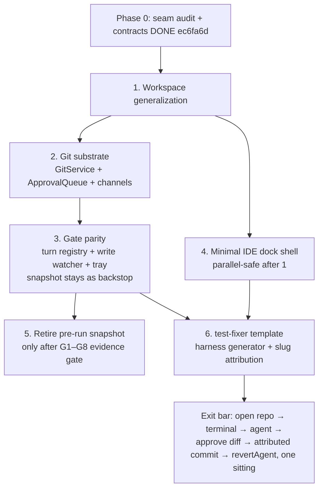

# Machina → Agentic Development Workstation: Vision & Build Plan

Canonical plan for the workstation track. Approved 2026-07-05. Companion docs:
`00-seam-audit.md` (file:line evidence), `01-interface-contracts.md` (Phase 1 contracts).

## Context

Machina is a shipped local-first knowledge engine: markdown vault, infinite canvas,
knowledge graph, embedded terminal with a block protocol, safety-gated native agent,
CLI-agent threads (Claude Code/Codex/Gemini), MCP server. The goal is to evolve it into a
**development workstation for programmers who want a single command center** — IDE
ergonomics, easy agent/loop creation, model-agnostic, leaning into Electron's
visual/mouse-driven strengths (not a keyboard-grammar tmux clone).

This plan consolidates a 13-decision grilling session, a 5-agent codebase/competitive
analysis, an extractability audit (re-verified in `00-seam-audit.md`), and the
agent-harness practices from `ai-engineering-from-scratch` phases 13–16.

Success criterion (Q3): the owner lives in it as a daily driver. Product ambitions are
earned later.

## Resolved decisions (the shared vision — do not re-litigate)

| #   | Decision                                                                                                                                                                                                                                  |
| --- | ----------------------------------------------------------------------------------------------------------------------------------------------------------------------------------------------------------------------------------------- |
| Q1  | Terminal/build-loop-first skeleton; supervisor view is a lens you zoom out to, not a separate app                                                                                                                                         |
| Q2  | Vision unconstrained by prior attempts (Mandatum out of scope)                                                                                                                                                                            |
| Q3  | Daily driver first; Electron/TS stack                                                                                                                                                                                                     |
| Q4  | Build onto Machina in place — one codebase, repurpose scaffolding                                                                                                                                                                         |
| Q5  | Workspace generalization (Cursor-like): Machina opens any folder; "a vault is a workspace with the knowledge capability enabled, not the reverse"                                                                                         |
| Q6  | Dock-centric IDE shell (editor center, terminal strip, agent panel, git map) + one-click session migration to canvas; zoom-out IS the supervisor lens (existing LOD rendering)                                                            |
| Q7  | Full IDE editor: CodeMirror 6 + incremental LSP client layer (language servers as main-process children over typed IPC). Not Monaco. Diff review first-class regardless                                                                   |
| Q8  | Session primitive: everything PTY-backed is a Session; adapters add projections. Plain terminal = session with no adapter; agent = session with adapter (structured thread view ⇄ raw PTY view, one click apart). Spawn-terminal-anywhere |
| Q9  | Loops = trigger × prompt × agent; per-loop autonomy policy; queue-all-writes is the immutable default; scoped auto-accept is deliberate opt-in                                                                                            |
| Q10 | Agent creation: curated 10-role gallery spanning guided, architecture, engineering, and raw-CLI bridge work + blank escape hatch; all produce the same transparent on-disk folder and require a concrete task brief at launch             |
| Q11 | Commit-per-approval checkpointing (attributed per agent/session via commit trailers, per-agent revert); worktrees deferred until usage demands                                                                                            |
| Q12 | Tracer-bullet first slice: open repo → spawn terminal → create templated agent → watch → approve diff → see attributed commit                                                                                                             |
| Q13 | Low knowledge-fusion + one free bridge: harness files (state, handoffs, lessons) are markdown in the workspace; knowledge capability indexes them like any note. No deeper entanglement yet                                               |

## The five primitives

1. **Workspace** — any folder Machina opens; capabilities (knowledge, coding) light up by
   content. Kills the single global `lastVaultPath`.
2. **Session** — a main-process PTY-backed object with identity, ring-buffer scrollback,
   lifecycle. Dock panes and canvas cards are _projections_; dock↔canvas migration =
   re-parent a projection (PTYs already survive webview teardown).
3. **Block** — command+output+exit structured via existing OSC shell hooks;
   navigation/copy/pin everywhere.
4. **Agent** — a session with an adapter { spawn cmd, resume mechanics, optional
   structured-event parser, model list } + a transparent harness folder on disk.
   Model-agnostic via adapter registry; unknown CLIs work day-one as raw terminal.
5. **Loop** — trigger (on-save / interval / on-fail / manual) × prompt × agent, with
   per-loop autonomy policy. The unoccupied market ground.

## Agent harness (curriculum-grounded)

Every created agent = a **folder of plain files** the app generates, visualizes, lints,
and never hides — schema in `01-interface-contracts.md` §5. Grounding: curriculum lessons
13.22 (portable skills), 14.33 (executable constraints), 14.36 (scope contracts), 14.38
(deterministic verification gates + signed overrides), 14.34/14.40 (repo memory,
handoffs), 15.13 (cost governors), 15.14 (kill switches/canaries), 15.15
(propose-then-commit), 15.16 (checkpoints).

Creation-wizard knobs: role (does/does-not), permission ladder (plan → prompt-on-risky →
accept-edits → allowlisted-exec → auto), verifier command, budget stack (max turns, max $,
velocity limit — non-optional for unattended), trigger, blast radius.

**Load-bearing correction carried into every phase: CLI-agent writes currently bypass
gate/audit/PathGuard entirely** (`00-seam-audit.md` §3). Gate parity for CLI agents is not
optional, and protection must never regress below today's pre-run-snapshot mechanism until
commit-per-approval fully replaces it.

## Phases

### Phase 0 — Seam re-verification + interface spec pass — **DONE** (`ec6fa6d`)

Deliverables shipped: `00-seam-audit.md` (work orders with file:line evidence),
`01-interface-contracts.md` (workspace service, git service, session/adapter/projection
types, gate-parity mechanism, harness schema, reserved IPC channels).

### Phase 1 — Tracer bullet (the daily-driver seed) — steps 1–2 DONE (`76d0699`, `3198ddd`)

Canonical order (v1.1, reordered after the 11-agent adversarial pass — gate parity
consumes GitService, so the substrate lands first; the snapshot stays wired until the
step 5 evidence gate):

Step detail and per-step contracts: `01-interface-contracts.md` §7 (v1.1).
Implementation specs: `02-phase-1-specs.md`. Exit bar (Q12): the full loop works
end-to-end on a real repo in one sitting.

### Phase 2 — The agent system — implementation DONE (2026-07-10)

Curated 10-role gallery + blank builder; required per-run task brief; adapter registry
(Claude Code, Codex, Gemini + raw-CLI fallback); model aliasing; two-projection agent view
(structured thread ⇄ raw PTY); budget stack + kill switch + circuit breakers; harness
linter; per-agent revert UI.
Exit bar: create a non-template agent from blank in <5 min; kill switch halts a runaway
loop; harness linter flags a broken scope contract.

Implementation specs: `04-phase-2-specs.md` (8 steps, canonical order; spec pass
2026-07-06 — records the "runaway loop := runaway turn/agent" exit-bar interpretation
and the adapter-native-hooks deferral). Step 8 landed the final implementation slice:
the ten-role gallery, visible New Agent entry point, blank builder, task-brief gate, and
raw bridge hardening.

### Phase 3 — Loops + the lens

Loop scheduler (trigger × prompt × agent, per-loop policy, queue-by-default); global
approval queue with notifications; canvas session cards + one-click dock↔canvas
migration; zoom-out supervisor lens via existing LOD; propose-then-commit for irreversible
ops. Exit bar: an on-fail loop fixes a broken test unattended with every write queued; a
live session migrates dock→canvas→dock without losing scrollback.

### Phase 4 — Earned depth

LSP languages incrementally (TS first); visual git map on the Pixi renderer;
knowledge-capability toggle polish; worktree isolation if parallel usage demands; MCP
third-party hardening — hash-pinned tool descriptions, registry defaults (curriculum
13.15, 13.17).

## Invariants (every phase)

- `npm run check` green at every phase boundary; no red-gate completions.
- Terminal core + block model keep behavior and latency (no capture/detection/rendering
  regressions).
- Knowledge features keep working behind the capability toggle — zero feature loss.
- Safety moves in the parity direction only; the verification gate stays
  agent-inaccessible; no window where neither snapshot nor commit-per-approval covers
  rollback.
- Existing patterns extended, not paralleled (store shape, 4-step IPC registration,
  dock-adapter shape).

## Verification

- **Tracer-bullet acceptance**: scripted walkthrough of the Phase-1 loop on a real repo,
  with evidence: gated write intercepted before being blessed, audit entry written, commit
  carrying `Machina-Agent`/`Machina-Session` trailers, revert of one agent's commits
  leaving other work intact.
- **Per-phase**: vitest units alongside changed services; `npm run check`; visual
  verification of new surfaces (screenshots shared/reviewed).
- **Harness proof method (curriculum 14.41)**: run the same task prompt-only vs harnessed
  on a sample repo; record the before/after comparison across the five outcomes (tests
  ran, acceptance met, out-of-scope files, handoff quality, reviewer score).
- **Lessons log** under `docs/refactor/` (one lesson per file); doc-reconciliation pass on
  every architecture change.
